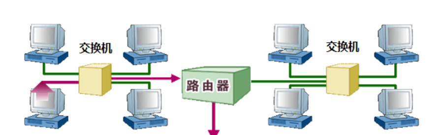
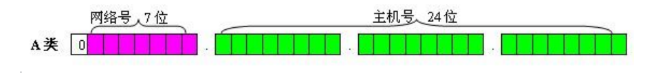
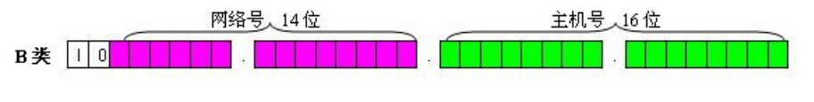
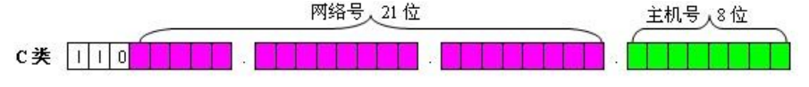
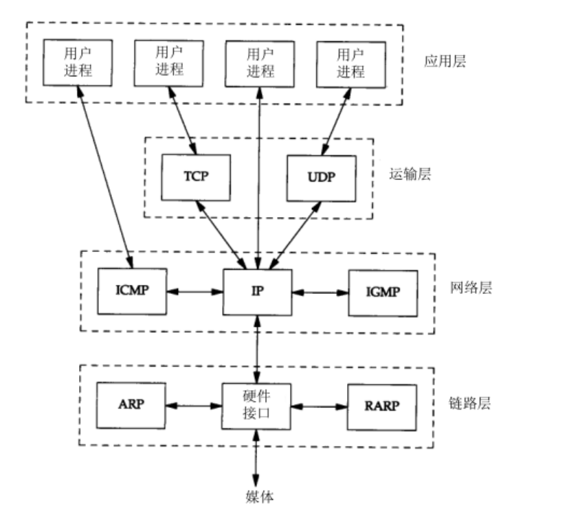
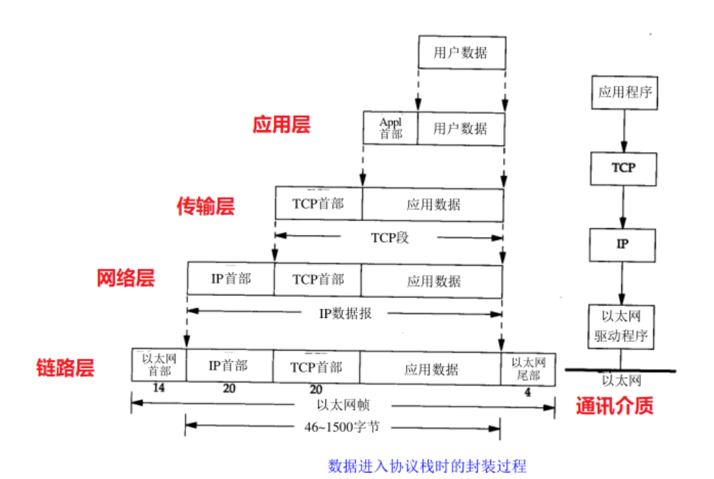
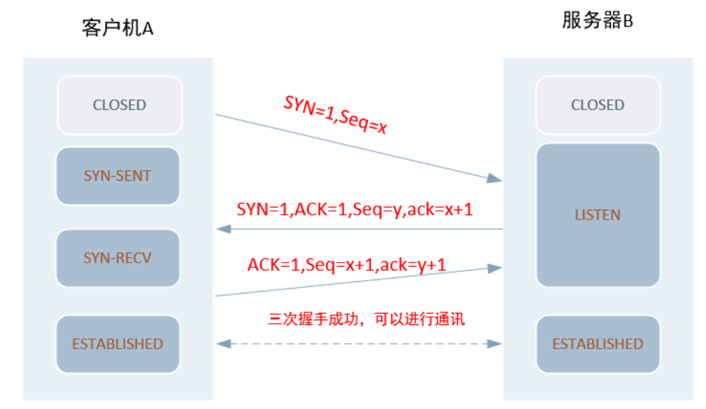
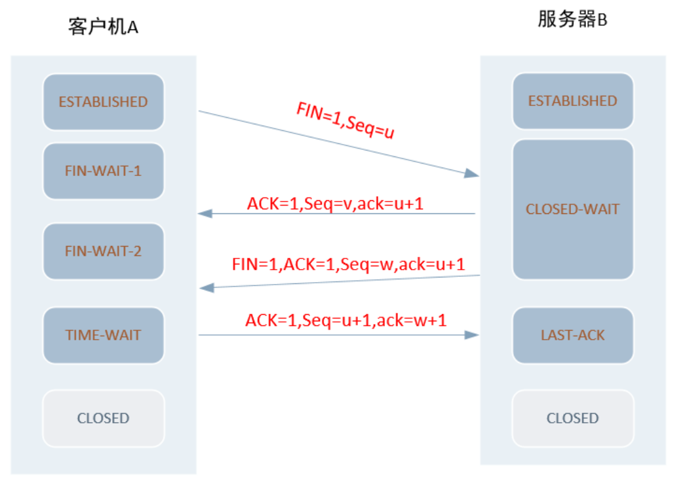
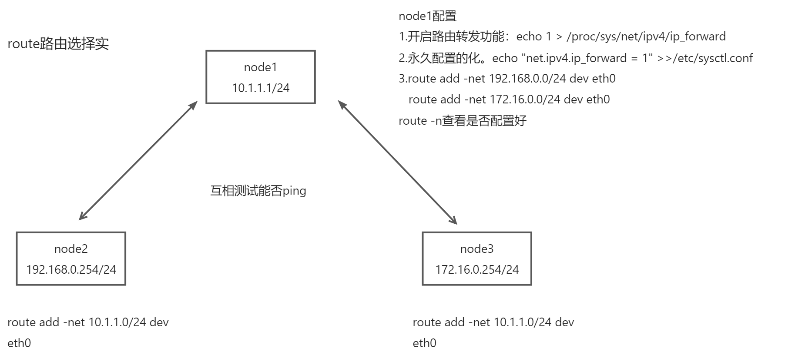

 交换机，路由器

# 网络基础知识扫盲

## 交换机路由器



路由器作用：**连接不同的网络**并且**找到网络中数据传输最合适的路径**

交换机：独享宽带

两者区别：

​	交换机属于OSI第二层即数据链路层设备。它根据MAC地址寻址

​	路由器属于OSI第三层即网络层设备，它根据IP地址进行寻址，通过路由表路由协议产生

## MAC地址和IP地址

**mac**:唯一物理地址，48位的十六进制数【00-E1-8C-D8-EC-FE 十六进制】

**IPV4**：32位的二进制数【192.168.1.1 十进制数】

**IPv6**：地址是128位【FE80:0000:0000:0000:AAAA:0000:00C2:0002】

IPv4地址使用"点分十进制"法表示；IPv6地址使用"冒分十六进制"法

IP地址应用与OSI第三层，网络层，MAC地址应有于第二层，数据链路层

为了方便寻址，ip地址被分为网络号+主机号

网络号：区分网络是否在同一区域（网段）

主机号：区分同一个网络中的主机，说明网络里有多少台主机。

**子网掩码**：用作于将IP地址划为网络号，和主机号，判断IP是否在同一个网路，其对应网络地址都为1,对应主机地址都为0

## A类地址，B类地址，C类地址




A类IP地址由1字节的网络地址和3字节主机地址组成，网络地址的最高位必须是"0";



B类IP地址由2个字节的网络地址和2个字节的主机地址组成，网络地址的最高位必须是"10";



C类IP地址由3字节的网络地址和1字节的主机地址组成，网络地址的最高位必须是"110";

## 子网划分

IP地址=网络号+主机号(子网位+主机位)

IP=网络位+子网位(n)+主机位(m)

划分方法：

子网位为n;主机位为m

则子网数为2^n个，主机数为2^m-2个。

子网掩码都是由一串连续的0和连续的1组成。这里可以将n看做后面有多少个1，m看做后面有多少个0。

::: tip
子网掩码：网络位为全为1，主机位全为0

多少【2^n】个子网，每个子网下可容纳多少[2^m-2]台主机

:::

1.根据子网掩码判断主机数

```tex
子网掩码为255.255.255.0时，可以容纳多个台设备？
分析：
1. 子网掩码由连续的1和连续0组成；
2. 用于判断IP地址网络位+主机位
255.255.255.0
11111111.11111111.11111111.0000000
主机数：2^8-2
255.255.248.0这个子网掩码可以最多容纳多少台电脑？
1. 将子网掩码转成二进制数
11111111.11111111.11111000.00000000
2. 判断有多少个连续的0
主机数：2^11-2=2046
```

2.根据主机和子网判断子网掩码

```tex
有一个B类网络145.38.0.0需要划分为20个能容纳200台主机的子网网络，子网掩码设置多少合适？
```

::: details

有两个维度，从主机维度算，和从网络数算

```js
1. B类网络 255.255.0.0  /16
2. 网络数大于等于20个子网；主机数大于等于200个主机
网络数：
11111111.11111111.11111000.00000000=255.255.248.0
2^n>=20 n=5,m=11
主机数：
11111111.11111111.11111111.00000000=255.255.255.0
2^m-2>=200 m=8,n=8
```

:::

3.根据IP和子网掩码判断子网数

```
已知192.168.0.0/255.255.255.128网络，请问最多可以划分几个子网，每个子网范围分别是多少
```

::: details

```js
1. 子网掩码转成二进制
C类默认： 11111111.11111111.11111111.00000000
实际掩码：11111111.11111111.11111111.10000000
结果：对比判断，当前IP向主机位借了1位；当前IP最多可以划分2^1个子网
2.判断每个子网的IP范围
x=0,-后面七位全0或者全1
192.168.0.0-------
192.168.0.0~192.168.0.127
有效的IP范围：
192.168.0.1~192.168.0.126/255.255.255.128
广播地址：192.168.0.127
x=1
192.168.0.1-------
192.168.0.128~192.168.0.255
有效的IP范围：
192.168.0.128~192.168.0.254/25
广播地址：192.168.0.255
```

:::

4.判断IP是否在同一个网段

:::details

```
192.168.1.254/24
IP: 11000000.10101000.00000001.11111110
子网掩码：11111111.11111111.11111111.00000000
11000000.10101000.00000001.00000000
192.168.0.254/24
IP：   11000000.10101000.00000000.11111110
NETMASK：11111111.11111111.11111111.00000000
1100000.10101000.00000000.00000000
方法：IP地址和子网掩码做and运算，然后判断网络位是否相同
```

:::

# OSI的七层模型

一共有七层：**物理层、数据链路层、网络层、传输层、会话层、表示层、应用层**

应用层：为用户提供服务，接口

表示层：数据格式处理，数据的编码，压缩和解压缩，数据的加密和解密

会话层：组织和协调两个会话进程之间的通信，并对数据交换进行管理。

传输层：向用户提供可靠的端到端的差错和流量控制，保证报文的正确传输

网络层：数据链路层的数据在这一层被转换为包，然后通过路径选择、分段组合、顺序、进/出路由等控制，将信息从一个网络设备传送到另一个网络设备

数据链路层：通过差错控制、流量控制方法，使有差错的物理线路变为无差错的数据链路，即向网络层提供可靠的通过物理介质传输数据的方法并且，还负责处理接收端发回的确认帧的信息，以便提供可靠的数据传输。

物理层：利用传输介质为数据链路层提供物理连接，实现比特流的透明传输


## TCP/IP协议模型





## TCP/IP三次握手



```
 TCP三次握手的过程如下：
 1. 客户机A端（主动连接端）发送一个SYN包给服务器B端（被动连接端）；
 2. 服务器B端（被动连接端）收到SYN包后，发送一个带ACK和SYN标志的包给客户机A端（主动连接端）；
 3. 客户机A端（主动连接端）发送一个带ACK标志的包给服务器B端（被动连接端），握手动作完成。
```

## TCP/IP四次断开



```
TCP四次断开的过程如下：
1. 客户机A端（主动连接端）发送一个FIN包给服务器B端（被动连接端）请求断开连接；
2. 服务器B端（被动连接端）收到FIN包后，发送一个ACK包给客户机A端（主动连接端）；
3. 服务器B端（被动连接端）发送了ACK包后，再发送一个FIN包给客户机A端（主动连接端）确认断开；
4. 客户机A端（主动连接端）收到FIN包后，发送一个ACK包，当服务器B端（被动连接端）收到ACK包后，四次断开动作完
成，连接断开
```


## 查看物理连接状态

查看物理连接状态

```shell
[root@localhost ~]# ethtool ens33
Settings for ens33:
	Supported ports: [ TP ]
	Supported link modes:   10baseT/Half 10baseT/Full 
	                        100baseT/Half 100baseT/Full 
	                        1000baseT/Full 
	Supported pause frame use: No
	Supports auto-negotiation: Yes
	Supported FEC modes: Not reported
	Advertised link modes:  10baseT/Half 10baseT/Full 
	                        100baseT/Half 100baseT/Full 
	                        1000baseT/Full 
	Advertised pause frame use: No
	Advertised auto-negotiation: Yes
	Advertised FEC modes: Not reported
	Speed: 1000Mb/s
	Duplex: Full
	Port: Twisted Pair
	PHYAD: 0
	Transceiver: internal
	Auto-negotiation: on
	MDI-X: off (auto)
	Supports Wake-on: d
	Wake-on: d
	Current message level: 0x00000007 (7)
			       drv probe link
	Link detected: yes
```

查看路由和dns配置

```shell
[root@localhost ~]# ip route
default via 192.168.12.2 dev ens33 proto static metric 100 
172.17.0.0/16 dev docker0 proto kernel scope link src 172.17.0.1 
192.168.12.0/24 dev ens33 proto kernel scope link src 192.168.12.140 metric 100 
[root@localhost ~]# cat /etc/resolv.conf
# Generated by NetworkManager
nameserver 114.114.114.114
```

重启网卡命令

```shell
ifup eth0
ifdown eth0
```

# 路由信息和抓包

什么是交换,什么是路由,什么是路由表？

:::details

```
1. 交换是指同网络访问（两台机器连在同一个交换机上，配置同网段的不同ip就可以直接通迅)
2. 路由就是跨网络访问(路径选择）
3. 路由表是记录路由信息的表，在Linux中⾸先是⼀张可见的,可更改的表,它的作⽤就是当数据包发到Linux的时候，系统（或者说内核)就根据这张表中定义好的信息来决定这个数据包接下来该怎么⾛.
```

:::

首先route命令安装

yum install net-tools -y

这个就是路由表

```shell
[root@localhost ~]# route -n
Kernel IP routing table
Destination     Gateway         Genmask         Flags Metric Ref    Use Iface
0.0.0.0         192.168.12.2    0.0.0.0         UG    100    0        0 ens33
172.17.0.0      0.0.0.0         255.255.0.0     U     0      0        0 docker0
192.168.12.0    0.0.0.0         255.255.255.0   U     100    0        0 ens33
```

Destination目标网络，Gateway网关，Genmask子网掩码，UG：该网关为路由器 UP:启动状态

## 路由怎么走的

ping一个公网IP，怎么走

:::details

```
1) 先看目标ip是否为本地ip，如果是，则直接访问本地;如果不是，则找路由表里是否有你访问的网段.
2) 如果路由表有则从这个路由条目后面指定的网卡出去；如果路由表里没有你访问的网段，则会找默认路由
 （也就是网关）。
3) 如果网关也没有的话，则会报错网络不可达。
connect: Network is unreachable
```

:::

## 如何加网关和删除网关，加网关有什么要求

:::details

```
route add default gw  x.x.x.x  临时加网关，马上生效
route del default gw  x.x.x.x   临时删网关，马上生效
永久生效
vim  /etc/sysconfig/network-scripts/ifcfg-eth0
GATEWAY=x.x.x.x
或者
vim /etc/rc.local 
route add default gw xxxxx
```

:::

::: warning
1.加网关只能加你已经有的路由网段里的一个IP才行（此IP不一定存在）

2.加网关可以不用指定子网掩码（因为是已有的一个网段的ip，所以掩码已经确认了)

:::

route常用命令

```shell
route -n  查看路由,显示ip,不解析
route del default gw 10.1.1.254   删除默认路由
route add default gw 192.168.1.110   添加一个默认网关，把所有不知道的网络交给网关来转发
route add -net 192.168.2.0/24 dev eth0 对一个网络添加一个新的路由（另一个网段）
route del -net 192.168.2.0/24
```

## 路由选择实验




# 抓包工具

## **1.wireshark**

安装抓包工具

```
yum -y install wireshark*
```

服务端:192.168.12.140安装

```shell
[root@localhost ~]# yum -y install telnet-server
………………………………
[root@localhost ~]# systemctl start telnet.socket
[root@localhost ~]# netstat -nltp|grep :23
tcp6       0      0 :::23                   :::*                    LISTEN      1/systemd        
```


## **2.tcpdump**

查看主机192.168.12.141收到的和发送的数据包

```shell
[root@localhost ~]# tcpdump -i ens33 -nn host 192.168.12.141
tcpdump: verbose output suppressed, use -v or -vv for full protocol decode
listening on ens33, link-type EN10MB (Ethernet), capture size 262144 bytes
23:27:40.426619 ARP, Request who-has 192.168.12.141 (00:0c:29:ad:08:0b) tell 192.168.12.3, length 46
23:27:40.426860 ARP, Reply 192.168.12.141 is-at 00:0c:29:ad:08:0b, length 46
23:27:58.356782 IP 192.168.12.141.52043 > 192.168.12.140.123: NTPv4, Client, length 48
23:27:58.356982 IP 192.168.12.140.123 > 192.168.12.141.52043: NTPv4, Server, length 48
23:28:03.365375 ARP, Request who-has 192.168.12.141 tell 192.168.12.140, length 28
23:28:03.365663 ARP, Reply 192.168.12.141 is-at 00:0c:29:ad:08:0b, length 46
```

-i 指定网络接口，对于多个网络接口有用
-n 显示IP地址，不查主机名。当DNS不起作用时常用到这个参数
-nn 不显示协议和端口名。即显示IP地址和端口
-w  将抓的包保存到指定的文件里方便后续分析

```shell
1.获取主机10.1.1.1接收或发出的telnet包
#tcpdump tcp port 23 and host 10.1.1.1
2.对本机的udp协议的123端口进行监听（123是ntp服务端口）
# tcpdump udp port 123
3.只对hostname的主机的通信数据包进行监视。主机名可以是本地主机，也可以是网络上的任何一台计算机。
下面的命令可以查看主机hostname发送的所有数据：
#tcpdump -i eth0 src host hostname
#tcpdump -i eth0 src host 10.1.1.254
4.下面的命令可以查看所有送到主机hostname的数据包：
#tcpdump -i eth0 dst host hostname
#tcpdump -i eth0 dst host 10.1.1.1
5.监视通过指定网关的数据包：
#tcpdump -i eth0 gateway Gatewayname
#tcpdump -i eth0 gateway 10.1.1.254
6.其他
只需要列出送到80端口的数据包，用dst port；
#tcpdump –i eth0 host hostname and dst port 80  //目的端口是80
只需要看到返回80端口的数据包，用src port
#tcpdump –i eth0 host hostname and src port 80 //源端口是80,一般是提供http的服务的主机
如果条件很多的话要在条件之前加and 或 or 或 not
#tcpdump -i eth0 host ! 210.161.223.70 and ! 210.161.223.71 and dst port 80
```


测试有报错

监视通过指定网关的数据包

```
[root@localhost ~]# tcpdump -i ens33 gateway 192.168.12.2
tcpdump: 'gateway' requires a name
[root@localhost ~]# tcpdump -i ens33 gateway 192.168.12.2
tcpdump: 'gateway' requires a name
[root@localhost ~]# tcpdump -i eth0 gateway 192.168.12.2
tcpdump: eth0: No such device exists
(SIOCGIFHWADDR: No such device)
[root@localhost ~]# tcpdump -i ens33 gateway 192.168.12.2
tcpdump: 'gateway' requires a name
[root@localhost ~]# tcpdump -i ens33 Gateway 192.168.12.2
tcpdump: syntax error
[root@localhost ~]# tcpdump -i ens33  192.168.12.2
tcpdump: syntax error
[root@localhost ~]# tcpdump -i ens33  192.168.12.2 192.168.12.140
tcpdump: syntax error
[root@localhost ~]# tcpdump -i ens33  192.168.12.2 192.168.12.141
```

6监听成功

```shell
[root@localhost ~]# tcpdump -i ens33 host 192.168.12.140 and dst port 80 
tcpdump: verbose output suppressed, use -v or -vv for full protocol decode
listening on ens33, link-type EN10MB (Ethernet), capture size 262144 bytes
```

