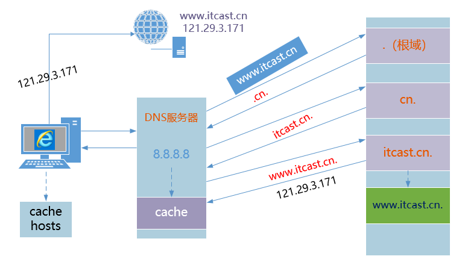

# DNS相关知识点

## DNS:域名管理系统

DNS的作用：

- 域名的正向解析

​		将主机域名转换为IP地址

​		**域名-->IP	A记录**

- 域名的反向解析

​		**IP --> 域名   PTR记录**


## DNS工作原理



安装dig相关工具

```shell
 yum install bind-utils -y
```


```
dig +trace www.baidu.com  	  追踪dns解析过程
dig @server www.baidu.com  	  正向解析查询
dig -x 192.168.0.1 @server    反向解析查询
dig +trace www.baidu.com  	  追踪一个域名解析过程
```


