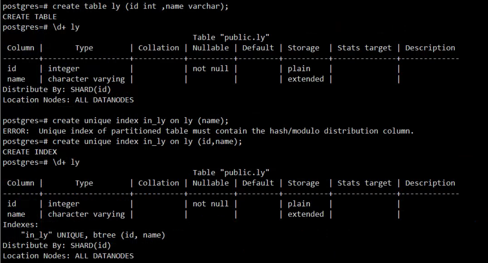
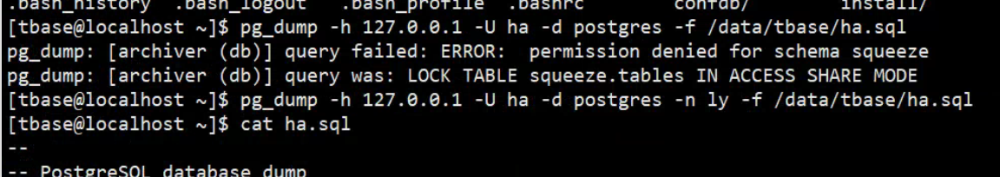
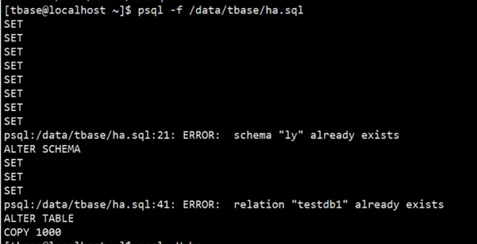
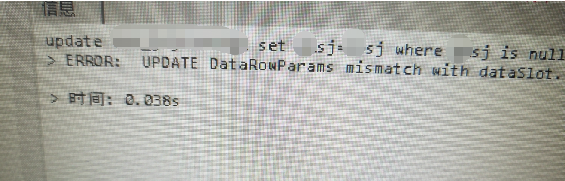
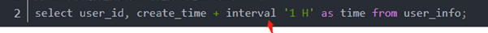
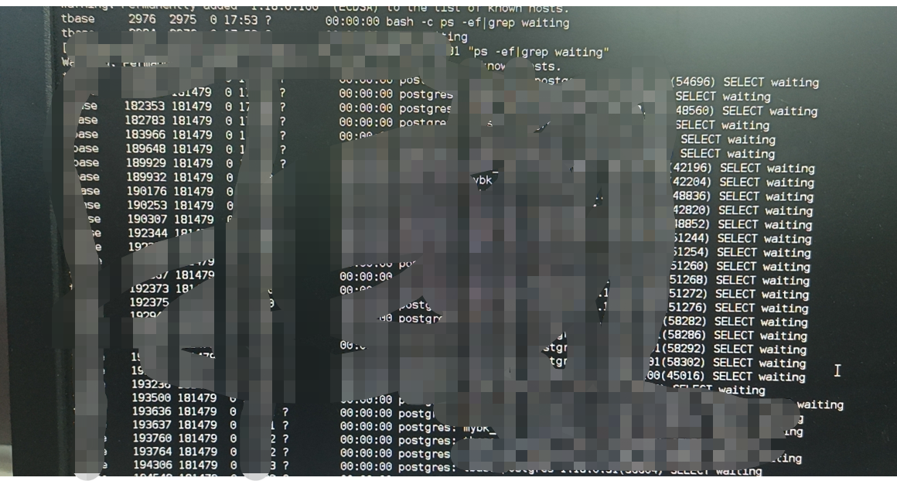
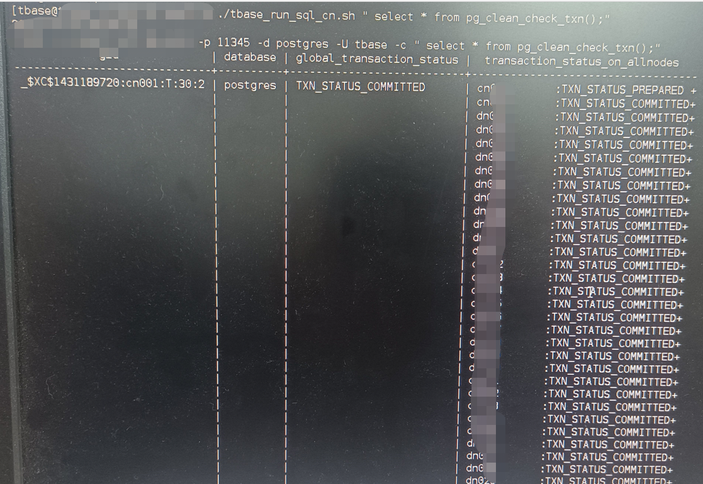
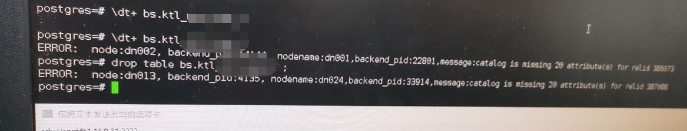
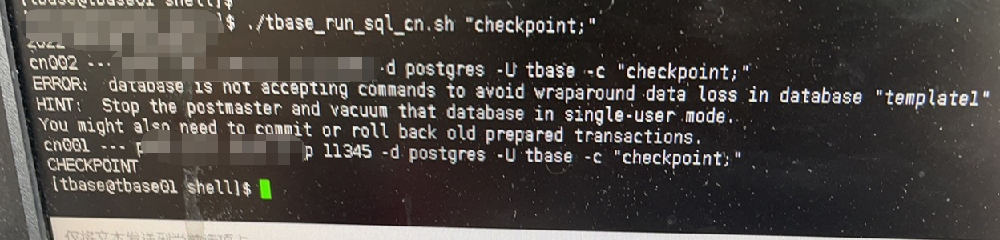
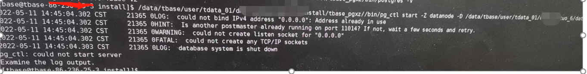

# 日常运维问题处理

## 1、对时间分区表，执行vacuum full报错

```sql
 postgres=# vacuum FULL   xxxxxpart_17;
   ERROR:    node:dn001, backend_pid:6576,   nodename:dn005,backend_pid:26069,message:tuple cannot be frozen now, please   try later xid 1236320620 cutoff xid 1239845757 committs 34278179476140   RecentDataTs 34275437824762 RecentGlobalXmin 1239855757 RecentGlobalDataXmin   1239855757
```

库的年龄大于200000000，则说明库出现问题
检查是否大于200000000

```sql
   查询所有表的年龄
   select   pg_namespace.nspname as schema_name,relname,age(relfrozenxid) as   xid_age,pg_size_pretty(pg_table_size(pg_class.oid))as table_size FROM   pg_class,pg_namespace where pg_namespace.oid=pg_class.relnamespace and   age(relfrozenxid)>20000000 and relfrozenxid!=0 order by age(relfrozenxid)   desc;
   查询指定表的年龄
   Select   pg_namespace.nspname as schema_name,relname,age(relfrozenxid) as   xid_age,pg_size_pretty(pg_table_size(pg_class.oid))as table_size FROM   pg_class,pg_namespace where pg_namespace.oid=pg_class.relnamespace and   age(relfrozenxid)>20000000 and relfrozenxid!=0 and relname='xxxxx';
   在库里面执行，复制出大于2亿的表，并且写好执行sql
   \copy   (select 'vacuum freeze '||nspname||'.'||relname||';' from   pg_class,pg_namespace where pg_namespace.oid=pg_class.relnamespace and   age(relfrozenxid)>200000000 and relfrozenxid!=0 order by age(relfrozenxid)   desc)to '/data/tbase/shell/freeze.sql'
   回收表年龄的时候，设置当前会话有效
   set   vacuum_defer_freeze_min_age to 10000000;
   set   lock_timeout to 30000;（可以不指定，超时会报错）
   执行导出的脚本
   \i   /data/tbase/shell/freeze.sql
   执行完之后再次统计信息
   select   count(*) from pg_class,pg_namespace where   pg_namespace.oid=pg_class.relnamespace and age(relfrozenxid)>200000000 and   relfrozenxid!=0 order by age(relfrozenxid) desc;

```

## 2、出现表膨胀问题

```sql
  postgres=# \dt+   xxxxx_part_17
                                        List of   relations
    Schema |        Name         | Type  |      Owner    |  Size    | Allocated Size | Description
   --------+---------------------+-------+-------------+--------+----------------+-------------
    lgzaxt | xxxxx_part_17 | table |   xxxxx_user | 515 GB | 504 GB         |
   (1 row)
   执行vacuum full进行回收空间
   postgres=# vacuum   FULL xxxxx_part_17;
   VACUUM
   postgres=# \dt+   xxxxx_part_17
                                        List of   relations
    Schema |        Name         | Type  |      Owner    | Size  | Allocated Size | Description
   --------+---------------------+-------+-------------+-------+----------------+-------------
    lgzaxt | xxxxx_part_17 | table |   xxxxx_user | 32 GB | 31 GB          |
   (1 row)
   

```

## 3、用户创建schema，并且授予所有权限

```sql
 create schema xxxxxzt;
   grant ALL on SCHEMA xxxxxzt to   xxxxx_user;
   alter schema xxxxxzt owner to xxxxx_user;
   Grant usage on schema schema_name to user_name;
   
创建用户B授权A用户的视图查询权限
CREATE USER user_stu  WITH PASSWORD '12345';
grant select on TABLE xl.view_students to user_stu ;
Grant usage on schema xl to user_stu;
授权createdb createrole权限
alter user xxx createdb；
```

## 4、慢查询慢sql

```sql
   查询大于10分钟慢查询
   select * from pg_stat_activity where   state<>'idel' and now() - query_start > interval '10min' order by   query_start;
   
```

## 5、查询宽表时报OUT-of-memory situation during sort

```
原因是：返回的字段数和行数比较多
解决：临时处理可以把返回的字段数减少或者行数加limit限制
单独解决：临时修改work_mem参数，再该SQL执行前加上set work_mem=102400;
```

## 6、创建表时报错create table is not permitted now（dn切换引入的问题）

```sql
原因：其中有dn节点上有锁
解决：注意去DN节点执行解锁
每个DN节点查看：select show_node_lock();
如果有返回值就进行解锁：node unlock with('c','n',10)；
```

## 7、突然服务器负载很高，大量的su进程，导致stolon的confdb一直重启

```sql
原因：通过top -c 发现异常进程，由于OSS问题，它一直在监控OSS，然后不停的重启stolon。
解决：重启OSS即可

```

## 8、tbase集群数据库闪断并产生大量得core文件

数据库会闪断，每次闪断有大量得core文件，业务是应用往一个表里写数据，表上有触发器，触发器再去调用存储过程。core文件如下：

```sql
gdb bin/postgres【使用的pg文件路径】 core文件
bt
通过f 4
p conn_count
p i
p *connections[i]
最终定位问题
解决办法：因为tbase对存储过程里得exception支撑不太友好，把exception删除即可，等后续版本优化
```

## 9、BUG：视图插入数据到表报错

```
版本2.15.19.1，以上其它版本都是2.15.16.10.报错例子和信息如下：
解决：是BUG问题，回退版本，后续研发优化
```

## 10、创建唯一索引报错

```sql
postgres=# create unique index in_ly on ly (name);
ERROR:  Unique index of partitioned table must contain the hash/modulo distribution column.
解决：创建唯一索引的时候得加上分布键，否则无法创建，或者创建的时候指定该字段为分布建
```



## 11.数据导出导入pg_dump和psql

导出模式，导出数据库报权限错误，应该接模式名



数据导入：多次导入会追加在后面



## 12、TDSQL默认建表数量1000张，否则会报如下错

```shell
too match tables,exceed the maximum value
解决：Proxy默认限制是每个实例上只能创建1000张表，可以在proxy的配置文件中修改，修改后重启使其生效。
路径：/data/tdsql_run/15002/gateway/conf/instance_15002.cnf
<table max=”1000”>
/data/tdsql_run/15003/gateway/bin/stop.sh  instance_15003
之后proxy会被ocagent自动拉起 或者 start_cgroup.sh  instance_15003
```

## 13 、tbase  插入数据 update会报错，select正常，报错如下



```shell
原因分析：因为该表上有触发器，再调用存储过程，删除触发器可以进行，具体原因还需要产研进行分析
初步排查，它触发器里去更分布键了。
```

## 14 、授权所有表给另外一个用户，包括后面新建的表（这句前面的表需要手动授权，之后的表会自动授权）

```sql
alter default privileges for user schema_owner in schema schema_name grant select on tables to user_name;
```

## 16、不能添加备库问题处理

```sql
问题现象：
添加备机失败，center日志中显示主键冲突，因tbl_oss_node_status中存在比序列值更大的nsid，导致新增节点时主键冲突
检查方法：
confdb中执行下面sql
select * from tbl_oss_node_status where nsid>currval('tbl_oss_node_status_nsid_seq'::regclass) order by nsid desc;
是否有记录
解决办法：
执行下面的sql增加序列值，直到大于上面查询到的最大nsid
select nextval('tbl_oss_node_status_nsid_seq'::regclass);
解决方法也可以这样
select setval('tbl_oss_node_status_nsid_seq',(select nsid from tbl_oss_node_status order by nsid desc limit 1));
扩展：查询批量序列值大的表
生成sql
select 'select * from '||n.nspname||'.'||c.relname||' where '||t.attname||' >'||replace(d.adsrc,'nextval','currval')||';'
from pg_class c join pg_namespace n on c.relnamespace=n.oid join pg_attrdef d on c.oid=d.adrelid join pg_attribute t on t.attrelid=c.oid and t.attnum=d.adnum where d.adsrc like '%seq%';
select 'select '||replace(d.adsrc,'nextval','currval')||';'
from pg_class c join pg_namespace n on c.relnamespace=n.oid join pg_attrdef d on c.oid=d.adrelid join pg_attribute t on t.attrelid=c.oid and t.attnum=d.adnum where d.adsrc like '%seq%';

```

## 17、不能分配指定服务器处理

```sql
临时处理一下
update tbl_oss_server set server_flag='dn' where server_ip in ('xx','xx');
update tbl_oss_server set server_flag='cn' where server_ip in ('xx','xx');
update tbl_oss_server set server_flag='gtm' where server_ip in ('xx','xx');
```

## 18、OSS升级后不能添加备机

```sql
一可能是里面有dn节点版本不一致
二可能缺表字段等
添加备机不成功的，我按照它的语句检查过confdb的字段，这些字段都是有的。alarm_meta.sql里有缺少的表的建表语句

 缺少字段报错对应的sql

alter table tbl_oss_project rename column num_of_cn to cn_groups;

alter table tbl_oss_project add column cns_in_group integer default 1;
alter table tbl_oss_project rename column cold_dn_num to cold_dn_groups;
alter table tbl_oss_project add column cold_dns_in_group integer default 2;

alter table tbl_oss_server add column server_flag text default 'all';
alter table tbl_oss_db_switch_info drop column slave_flow;
alter table tbl_oss_db_switch_info drop column master_flow;
alter table tbl_oss_tbase_charset add column is_visible boolean default false;
update tbl_oss_tbase_charset set is_visible = true where lang_name in ('UTF8','LATIN1','SQL_ASCII','EUC_CN');
三可能主键冲突
问题现象：
添加备机失败，center日志中显示主键冲突，因tbl_oss_node_status中存在比序列值更大的nsid，导致新增节点时主键冲突

检查方法：
confdb中执行下面sql
select * from tbl_oss_node_status where nsid>currval('tbl_oss_node_status_nsid_seq'::regclass) order by nsid desc;
是否有记录
解决办法：
执行下面的sql增加序列值，直到大于上面查询到的最大nsid
select nextval('tbl_oss_node_status_nsid_seq'::regclass);
```

## 19、缺少插件function connect by

```sql
解决方法:
set search_path= 用户使用的schema;
create extension tablefunc;
```

## 20、时间类型转换问题

```sql
Cloud not choose a best candidate operator.you might need to add explicit type casts
解决方法：加 interval转换就好了
```



## 22、schema权限问题：ERROR：permission denied for schema *

```sql
解决方法：
进入数据库：
Grant usage on schema schema_name to user_name;
```

## 24.分区表分区不够添加分区,

```sql
加1个分区
alter table 主表名 add partitions 1;
```

## 25、切换DN后所有查询uuid相关的SQL报错

```sql
解决方法：因为上架的新服务器没有安装UUID相关的包，安装上就可以了，不用重启
yum -y install uuid
yum -y install uuid-devel
yum -y install e2fsprogs-devel uuid-devel libuuid-devel uuid
```

## 26、查看schema、table大小

```sql
--查看schema
SELECT schema_name, 
    pg_size_pretty(sum(table_size)::bigint) as "disk space",
    round((sum(table_size) / pg_database_size(current_database())) * 100,2)
        as "percent(%)"
FROM (
     SELECT pg_catalog.pg_namespace.nspname as schema_name,
         pg_total_relation_size(pg_catalog.pg_class.oid) as table_size
     FROM   pg_catalog.pg_class
         JOIN pg_catalog.pg_namespace 
             ON relnamespace = pg_catalog.pg_namespace.oid
) t
GROUP BY schema_name
ORDER BY "percent(%)" desc;
--查看table大小
SELECT
    table_catalog AS database_name,
    table_schema AS schema_name,
    table_name,
    pg_size_pretty(relation_size) AS table_size
FROM (
    SELECT
        table_catalog,
        table_schema,
        table_name,
        pg_total_relation_size(('"' || table_schema || '"."' || table_name || '"')) AS relation_size
    FROM information_schema.tables
    WHERE table_schema not in ('pg_catalog', 'public', 'public_rb', 'topology', 'tiger', 'tiger_data', 'information_schema')
    ORDER BY relation_size DESC
    )
    AS all_tables;
--查看表大小及索引占用大小
select pt.schemaname||'.'||pt.tablename,pg_relation_filepath(pt.schemaname||'.'||pt.tablename),
       pg_size_pretty(pg_table_size(pt.schemaname||'.'||pt.tablename)) as pg_table_size,
       pg_size_pretty(pg_relation_size(pt.schemaname||'.'||pt.tablename)) as pg_relation_size,
       pg_size_pretty(pg_total_relation_size(pt.schemaname||'.'||pt.tablename)) as pg_total_relation_size,
       pi.schemaname||'.'||pi.indexname,pg_relation_filepath(pi.schemaname||'.'||pi.indexname),
       pg_size_pretty(pg_relation_size(pi.schemaname||'.'||pi.indexname)) as table_index_size,
       pg_size_pretty(pg_indexes_size(pi.schemaname||'.'||pi.tablename)) as table_all_index_size
 from pg_tables pt
      left outer join pg_indexes pi
                   on pt.schemaname||'.'||pt.tablename = pi.schemaname||'.'||pi.tablename
where pt.schemaname=''
  and pt.tablename='';

注意：pt.schemaname=''
  and pt.tablename='';
对应模式名和表名
```

## 27、更新版本后，cn查询视图按tab时卡住，当台服务器上有waiting，pg_blocking_pid指向0



```
解决办法，因为是两阶段事务问题
create extension pg_clean;创建
select * from pg_clean_check_txn ();查看两阶段事务
select * from pg_clean_execute();清理两阶段

```



## 28、元数据不一致，有的dn能查询有的dn不能查询



```sql
解决办法：根据报错的relid 到全部dn上查询下面语句找到对应的表
select relname from pg_stat_user_tables where relid = '370303';
然后到所有dn查询该表看能不能查出，若有的dn不能查出就是有问题，联系看能否删除
因为表有问题，不能直接删除，删除会报错，按如下删除：
dn 上面执行
set allow_force_ddl to on;
set allow_dml_on_datanode to on；
drop table if exists xxx；
最后恢复
```

## 29、不能删除索引或者表的方法

```sql
提示索引或者表存在，但是去查询或者删除时又查不到，这时删除方法为
delete from pg_class where oid='oid号';
delete from pg_depend where objid='oid号'
```

## 30、查看索引坏块的语句

```sql
检查已损坏索引：
select schemaname,tablename,indexname,split_part(split_part(indexdef,'(',2),')',1) from pg_indexes where indexname in (select relname from pg_class where oid in (select indexrelid from pg_index where indisvalid = 'f')) order by tablename asc;
```

## 31、查询表时报错如下

```sql
ERROR: could not access status of transaction 5483489
DETAIL: could not read from file "pg_clog/0202" at offset 0:Conseguido
pg_clog 目录下都是事务文件，如果丢失则表信息则不可用
解决办法：查看目录里其它文件的大小。比如是256k ，然后执行下面语句生成一个报错的文件。
dd if=/dev/zero of=0202 bs=256k count=1
```

## 32.database “template0“ is not currently accepting connections

```sql
问题：执行尝试登录template0，登录不上，回收template0年轮
原因：template0 数据库默认是不允许登录的
解决方法：
1.用超级用户执行以下命令
update pg_database set datallowconn = TRUE where datname = 'template0';
2.进入template0，执行vacuum free;有时候自己就回收了，还有执行这个操作。
3.还原权限
update pg_database set datallowconn = FALSE where datname = 'template0';
```

## 33.pg10分区表不支持upsert解决方法

```sql
原生pg就不支持，可以采用函数的方式实现
参考连接：
https://blog.csdn.net/weixin_33896069/article/details/92922520
https://blog.csdn.net/weixin_34077371/article/details/90588640
```

## 34.pg9版本年龄查询

```
在v2版本查询的方式下！=0那里加上age（），
age(relfrozenxid)!=0
```

## 35、查看tbase得分布键和分区键

```sql
先根据表名查询出oid也就是下面的pcrelid
SELECT c.oid,
  n.nspname,
  c.relname
FROM pg_catalog.pg_class c
     LEFT JOIN pg_catalog.pg_namespace n ON n.oid = c.relnamespace
WHERE c.relname ~ '^(表名)$'
  AND pg_catalog.pg_table_is_visible(c.oid)
ORDER BY 2, 3;

查看分布键
SELECT CASE pclocatortype WHEN 'N' THEN 'ROUND ROBIN' WHEN 'R' THEN 'REPLICATION' WHEN 'H' THEN 'HASH' WHEN 'S' THEN 'SHARD' WHEN 'M' THEN 'MODULO' END as distype,(SELECT  attname where  a.attrelid = c.pcrelid and a.attnum = c.pcattnum) as discolumn, (SELECT  attname from pg_catalog.pgxc_class x,  pg_catalog.pg_attribute a1 where  a1.attrelid = 3661861 and a1.attnum = x.psecondattnum and x.pcrelid = 3661861) as disseccolumn, CASE array_length(nodeoids, 1) WHEN nc.dn_cn THEN 'ALL DATANODES' ELSE array_to_string(ARRAY( SELECT node_name FROM pg_catalog.pgxc_node WHERE oid in (SELECT unnest(nodeoids) FROM pg_catalog.pgxc_class WHERE pcrelid = '3661861') ), ', ') END as loc_nodes, CASE array_length(coldnodeoids, 1) WHEN nc.dn_cn THEN 'ALL DATANODES' ELSE array_to_string(ARRAY( SELECT node_name FROM pg_catalog.pgxc_node WHERE oid in (SELECT unnest(coldnodeoids) FROM pg_catalog.pgxc_class WHERE pcrelid = '3661861') ), ', ') END as cold_nodes FROM pg_catalog.pg_attribute a right join pg_catalog.pgxc_class c on a.attrelid = c.pcrelid and a.attnum = c.pcattnum, (SELECT count(*) AS dn_cn FROM pg_catalog.pgxc_node WHERE node_type = 'D') as nc WHERE pcrelid = '3661861' ;

查看分区键
SELECT 'RANGE(' || a.attname || ')', p.partnparts,p.partdatatype, p.partstartvalue_ts :: date, p.partstartvalue_int,CASE WHEN p.partinterval_type=5  THEN p.partinterval_int || ' MONTH' WHEN p.partinterval_type=4 THEN p.partinterval_int || ' DAY' ELSE p.partinterval_int || '' END as step
FROM pg_class c, pg_attribute a, pg_partition_interval p
WHERE c.oid=a.attrelid AND c.oid=p.partrelid AND p.partpartkey=a.attnum AND c.oid='3661861'
```

## 36、提示stop the postmaster and vacuum that database in single-user mode



```sql
解决办法
1、	停止对应的cn
2、进入单用户模式下回收
#配置环境变量，具体路径换成实例环境信息的目录路径
export PGXZ_HOME=/data/tbase/user_1/tdata_03/tbasev2/2.15.12/install/tbase_pgxz/
export PATH=$PGXZ_HOME/bin:$PATH
export LD_LIBRARY_PATH=$PGXZ_HOME/lib:${LD_LIBRARY_PATH}
#进入你要回收的库
postgres --single -D /data/tbase/user_1/tdata_02/tbase_v2_01_1/data/cn001 postgres
#执行回收
backend> vacuum;
#退出
backend>修复后按 ctrl+d 退出
3、修复完启动
```

## 38、有一个主dn拉起来有进程但是连不上，并且产生很多得postgresql.conf.rename.tm705400818.pid27878.ppid27258.tid139866427488类似文件

```sql
解决办法：从其他dn复制postgresql.conf的内容到报错的这个dn，注意修改port端口和pooler_port端口，以及postgresql.conf.user的绝对路劲，两个端口可以在confdb里查询tbl_oss_node表
```

## 40、重做备机后数据文件同步完了，但是显示重做失败，日志里-V报错信息。

```sql
解决办法：这是由于tbase_oss的bin文件问题，不知道bin文件怎么了，导致重做备机后配置文件跟主dn一致的。从其它正常的dn目录下面拷贝tbase_oss整个文件夹来替换了，然后重做备机即可
```

## 41、重做备机后数据文件同步完了，但是启动不了，手动启动也是报错。



```sql
这是端口占用问题，查看confdb里的端口，和这里的端口对比发现，主dn的 poller_port端口错了，但是重做备机后备机的端口是对的，所以就会冲突，解决就是按照confdb里的tbl_oss_node表里的端口，对应修改postgresql.conf里的端口，然后重启即可
```

## 42、单机创建database和user后，drop table时报permission denied for schema pglogical 

```sql
创建语法：
create user hahha with password 'hahha';
create database hahhadb owner hahha;
grant all on database hahhadb to hahha;
解决办法：
grant usage on schema pglogical to hahha

```

## 43、TDSQL 非分布式maridb8.0实例需要关闭主键限制sql_require_primary_key

```shell
TDSQL默认要使用主键，还是8.0的实例也默认有参数控制要使用主键，如果实在要取消有也可以，但有主备延迟，性能等一定的风险
解决办法：
新的版本直接在赤兔参数管理即可
如果旧的版本那里没有相关参数的话，到主库，对应的端口mysqlagent下执行下面语句，记得修改端口和set name
cd /data0/tdsql_run/4036/mysqlagent/bin
./mysql_param_modify --agent-conf="../conf/mysqlagent_4036.xml" --mode="modify" --param="param=sql_require_primary_key&conf=sql_require_primary_key&value=OFF" --name="set_1652943133_114"
如果是8.0之前的版本只需要在赤兔界面，对应的实例，参数管理找到reject_table_no_pk改为0即可

```

