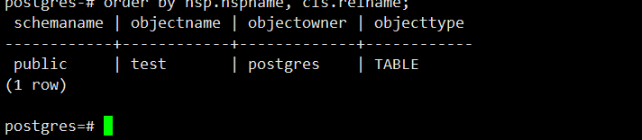

# 获取用户下所有对象

```sql
select
nsp.nspname as SchemaName
,cls.relname as ObjectName
,rol.rolname as ObjectOwner
,case cls.relkind
when 'r' then 'TABLE'
when 'm' then 'MATERIALIZED_VIEW'
when 'i' then 'INDEX'
when 'S' then 'SEQUENCE'
when 'v' then 'VIEW'
when 'c' then 'TYPE'
else cls.relkind::text
end as ObjectType
from pg_class cls
join pg_roles rol
on rol.oid = cls.relowner
join pg_namespace nsp
on nsp.oid = cls.relnamespace
where nsp.nspname not in ('information_schema', 'pg_catalog')
and nsp.nspname not like 'pg_toast%'
and rol.rolname = 'postgres'
order by nsp.nspname, cls.relname;
```

效果：

