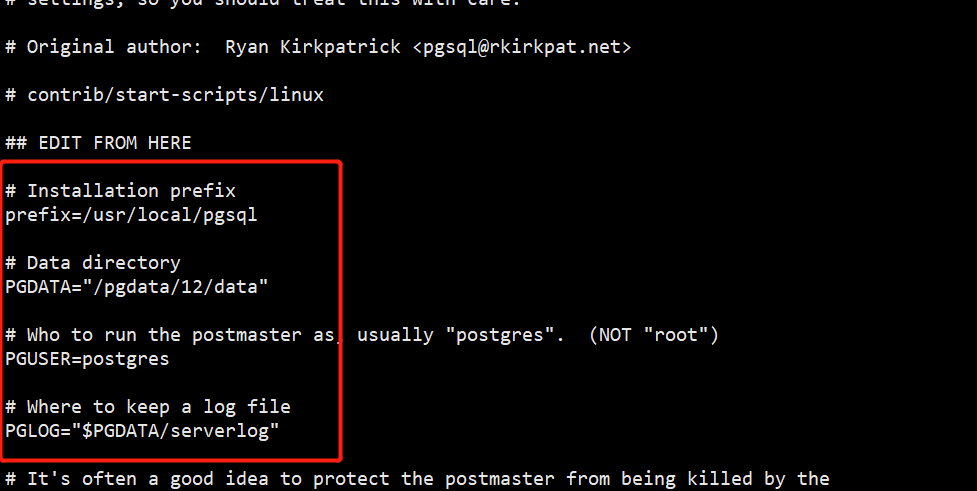

# postgresql设置开机启动

1、打开源码找到./contrib/start-scripts/linux文件

2、复制linux文件到/etc/init.d文件夹下

cp {源码路径}/contrib/start-scripts/linux /etc/init.d

3、修改文件名为postgresql

mv /etc/init.d/linux /etc/init.d/postgresql

4、修改postgresql文件配置

　　vim /etc/init.d/postgresql

　　　　prefix设置为你的安装路径

　　　　PGUSER设置为操作postgreSQL的用户（默认为postgres）

　　　　PGLOG是日志路径

　　　　　　注：如果设置的日志路径没有server.log,需要手动创建此文档

5、给postgresql分配执行权限

chmod a+x /etc/init.d/postgresql

6、添加开机启动

chkconfig --add postgresql 

7、重启服务器验证设置是否成功

reboot

8、查询服务启动是否正常
systemctl status postgresql