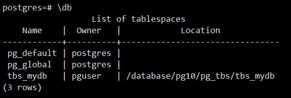
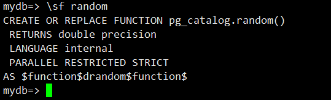
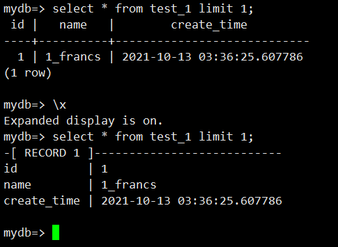

# 基础配置

## 部署管理配置

使用pg_ctl方式进行管理

1.数据库的启动，查看状态，关闭

```
[root@localhost ~]# su - postgres
Last login: Tue Oct 12 23:34:33 EDT 2021 on pts/1
[postgres@localhost ~]$ /opt/pgsql/bin/pg_ctl -D /pgdata/10/data/ start
waiting for server to start....2021-10-13 00:40:19.174 EDT [25652] LOG:  listening on IPv6 address "::1", port 1921
2021-10-13 00:40:19.174 EDT [25652] LOG:  listening on IPv4 address "127.0.0.1", port 1921
2021-10-13 00:40:19.176 EDT [25652] LOG:  listening on Unix socket "/tmp/.s.PGSQL.1921"
2021-10-13 00:40:19.189 EDT [25653] LOG:  database system was shut down at 2021-10-12 23:36:10 EDT
2021-10-13 00:40:19.191 EDT [25652] LOG:  database system is ready to accept connections
 done
server started
[postgres@localhost ~]$ /opt/pgsql/bin/pg_ctl -D /pgdata/10/data/ status
pg_ctl: server is running (PID: 25652)
/opt/pg10/bin/postgres "-D" "/pgdata/10/data"
[postgres@localhost ~]$ /opt/pgsql/bin/pg_isready -p 1921
/tmp:1921 - accepting connections
[postgres@localhost ~]$ /opt/pgsql/bin/pg_ctl -D /pgdata/10/data/ -ms stop　　#smart（-ms）,fast(-mf),immediate(-mi)三种关闭模式
waiting for server to shut down....2021-10-13 00:43:51.783 EDT [25652] LOG:  received smart shutdown request
2021-10-13 00:43:51.784 EDT [25652] LOG:  worker process: logical replication launcher (PID 25659) exited with exit code 1
2021-10-13 00:43:51.785 EDT [25654] LOG:  shutting down
2021-10-13 00:43:51.791 EDT [25652] LOG:  database system is shut down
 done
server stopped
```

2.配置开机启动

1.配置服务脚本，将linux脚本拷贝到/etc/init.d/中，将脚本重命名为postgresql-10并赋予执行权限

```
[root@localhost ~]# ls postgresql-10.0/contrib/start-scripts/
freebsd  linux  osx
[root@localhost ~]# cp postgresql-10.0/contrib/start-scripts/linux /etc/init.d/postgresql-10
[root@localhost ~]# chmod +x /etc/init.d/postgresql-10
[root@localhost ~]# ls -lh /etc/init.d/postgresql-10
-rwxr-xr-x. 1 root root 3.5K Oct 13 00:48 /etc/init.d/postgresql-10
```

使用

chkconfig --list查看postgresql是否开机启动

设置开机启动，或关闭chkconfig postgresql-10 on/off

3.数据库配置基础

postgresql中两个重要的全局配置文件postgresql.conf(文件配置，资源限制，集权设置)和pg_hba.conf（客户端连接和认证）都存于初始化目录中

全局配置的修改方法

- 修改postgresql.cong文件
- 在库中通过alter system set 命令修改全局配置（会产生一个postgresql.auto.conf文件，数据库启动时会加载此文件，并覆盖postgresql.conf中配置，不要修改它）

非全局修改方法

- 设置database级别
- alter database name set configparameter 
- 设置session级别配置
- 通过set命令设置当前session配置

查询配置　　show all

使配置生效：

```
select pg_reload_conf();
或者
[postgres@localhost ~]$ /opt/pgsql/bin/pg_ctl -D /pgdata/10/data reload
server signaled
2021-10-13 01:31:28.393 EDT [25748] LOG:  received SIGHUP, reloading configuration files
```

允许数据库远程访问，需修改监听地址，pg_hba.conf文件

```
 vi /pgdata/10/data/postgresql.conf
找到#listen_addresses = 'localhost'改为
listen_addresses = '*'
重启数据库：　 /opt/pgsql/bin/pg_ctl -D /pgdata/10/data stop/startecho "host mydb pguser 0.0.0.0/0 md5" >> /pgdata/10/data/pg_hba.confreload生效/opt/pgsql/bin/pg_ctl -D /pgdata/10/data/ reload
```

　　

配置默认环境，设置完后执行source ~/.bashrc

```
vi ~/.bashrc
export PG_HOME=/opt/pgsql
export PATH=$PG_HOME/bin:$PATH
PGUSER=postgres
PGHOST=127.0.0.1
PGDATABASE=postgres
PGPORT=1921
```

 

## 基本操作

--创建用户，创建空间目录，创建数据库，赋权

```
postgres=# create role pguser with password 'pguser';
CREATE ROLE
[root@localhost ~]# mkdir -p /database/pg10/pg_tbs/tbs_mydb
root@localhost ~]# chown -R postgres.postgres /database
[postgres@localhost ~]$ psql
psql (10.0)
Type "help" for help.

postgres=# create tablespace tbs_mydb owner pguser location '/database/pg10/pg_tbs/tbs_mydb';
CREATE TABLESPACE
postgres=# create database mydb with owner = pguser TEMPLATE=template0 ENCODING = 'UTF8' TABLESPACE=tbs_mydb;
CREATE DATABASE

postgres=# grant ALL on DATABASE mydb to pguser with Grant option;(WITH GRANT OPTION 这个选项表示该用户可以将自己拥有的权限授权给别人)
GRANT
postgres=# grant ALL on TABLESPACE tbs_mydb to pguser ;
GRANT

postgres=# alter role pguser login ;
ALTER ROLE
```

--psql元命令介绍

\l查看库

\db查看表空间



 

\d查看表定义

mydb=> create table test_1(id int,name text ,create_time timestamp without time zone default clock_timestamp());
CREATE TABLE

mydb=> alter table test_1 add primary key (id);
ALTER TABLE
mydb=> \d test_1
Table "public.test_1"
Column | Type | Collation | Nullable | Default
-------------+-----------------------------+-----------+----------+-------------------
id | integer | | not null |
name | text | | |
create_time | timestamp without time zone | | | clock_timestamp()
Indexes:
"test_1_pkey" PRIMARY KEY, btree (id)

查看表，索引大小

```
mydb=> insert into test_1 (id,name) select n,n || '_francs' from generate_series(1,500000) n;
INSERT 0 500000
mydb=> select * from test_1  limit 1;
 id |   name   |        create_time
----+----------+----------------------------
  1 | 1_francs | 2021-10-13 03:36:25.607786
(1 row)
mydb=> \di+ test_1_pkey
                          List of relations
 Schema |    Name     | Type  | Owner  | Table  | Size  | Description
--------+-------------+-------+--------+--------+-------+-------------
 public | test_1_pkey | index | pguser | test_1 | 11 MB |
(1 row)
```

\sf查看函数代码



\x设置查询结果输出模式



psql导入、导出数据表

COPY是sql命令，需要superuser，主机上的文件

\copy是元命令，不需要superuser，psql端文件

COPY导入导出命令

```
[postgres@localhost ~]$ cat test_copy.txt
1    a
2    b
3    c
4    d
[postgres@localhost ~]$ psql mydb postgres
mydb=# COPY public.test_copy from '/home/postgres/test_copy.txt';（实例名）
COPY 4
mydb=# select * from test_copy ;
 id | name
----+------
  1 | a
  2 | b
  3 | c
  4 | d
(4 rows)
```

导出

```
mydb=# COPY public.test_copy to '/home/postgres/test.txt';
COPY 4
mydb=# \q
[postgres@localhost ~]$ ls
test_copy.txt  test.txt
[postgres@localhost ~]$ cat test.txt
1    a
2    b
3    c
4    d
```

导出到csv格式：加 with csv header导出格式为csv，并显示字段名称

```
mydb=# copy public.test_copy to '/home/postgres/test_copy.csv' with csv header;
COPY 4
```


 

 如何导出部分数据，导出表test_copy，id等于2的数据

```
mydb=# copy (select * from public.test_copy where id=2) to '/home/postgres/test_copy.csv' with csv header;
COPY 1
mydb=# \q
[postgres@localhost ~]$ ls
test_copy.csv  test_copy.txt  test.txt
[postgres@localhost ~]$ cat test_copy.csv
id,name
2,b
```

 

\copy原命令数据导入导出，一样的，把COPY命令换位\copy即可

小表用\copy,大表建议用COPY效率更高

 