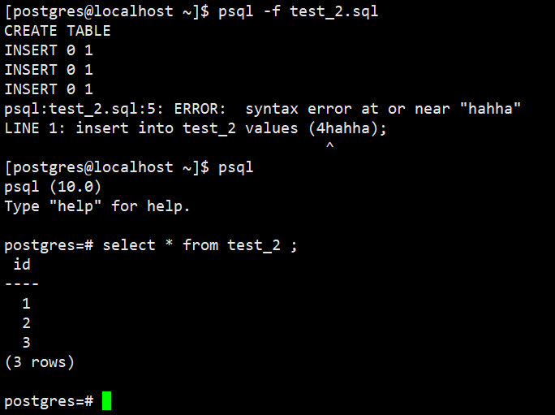
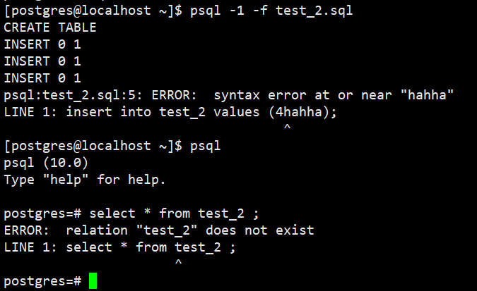

# postgresql导入数据库脚本文件

<Badge text="要点"/>


**psql -1 -f支持在一个事务中的脚本，要么所有sql执行成功，要么所有sql执行失败，文件所有sql回滚**

--编写脚本文件

[postgres@localhost ~]$ cat test_2.sql
create table test_2(id int4);
insert into test_2 values (1);
insert into test_2 values (2);
insert into test_2 values (3);
insert into test_2 values (4);

导入数据（也可以指定库，用户），加上参数q之后可以不在显示具体信息

[postgres@localhost ~]$ psql -f test_2.sql
CREATE TABLE
INSERT 0 1
INSERT 0 1
INSERT 0 1
INSERT 0 1

或者

[postgres@localhost ~]$ psql -q -f test_2.sql

psql -1 -f支持在一个事务中的脚本，要么所有sql执行成功，要么所有sql执行失败，文件所有sql回滚




## 通过-v参数传递变量

--编写test_2.sql脚本

```
[postgres@localhost ~]$ cat test_2.sql
select * from test_2 where id=:v_id;
通过-v传递参数
[postgres@localhost ~]$ psql -v v_id=1 -f test_2.sql
id
----
1
(1 row)
```

 

 