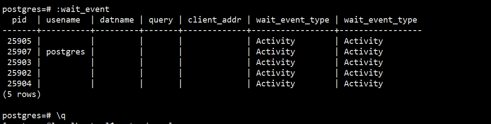

# 通过配置.psqlrc文件,定制日常维护脚本

编辑cat ~/.psqlrc文件

添加脚本

```
[postgres@localhost ~]$ cat ~/.psqlrc
\set active_session ' select pid,usename,datname,query,client_addr from pg_stat_activity where pid <> pg_backend_pid() and state=\'active\' order by query;'
```

使用方法：冒号后面接变量名

```
postgres=# :active_session
 pid | usename | datname | query | client_addr
-----+---------+---------+-------+-------------
(0 rows)
```

查询等待事件脚本

```
[postgres@localhost ~]$ cat ~/.psqlrc
\set active_session ' select pid,usename,datname,query,client_addr from pg_stat_activity where pid <> pg_backend_pid() and state=\'active\' order by query;'
\set wait_event 'select pid,usename,datname,query,client_addr,wait_event_type,wait_event_type from pg_stat_activity where pid <> pg_backend_pid() and wait_event_type is not null order by wait_event_type;'
```



 