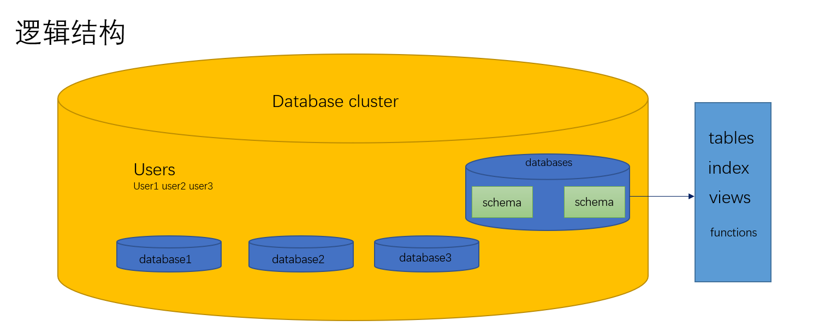
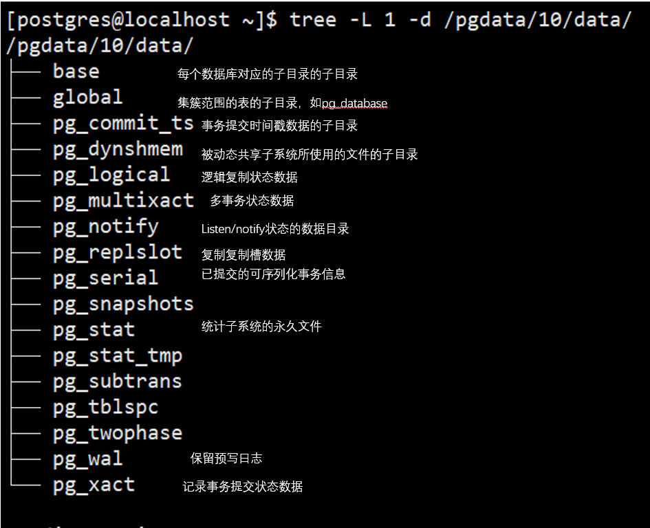
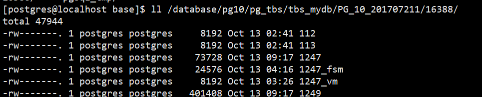

# PostgreSQL体系结构概述

## PostgreSQL的物理架构：

由共享内存、一系列后台进程和数据文件组成

### 一、共享内存

是服务器为数据库缓存和事务日志缓存预留的内存缓存空间
Shared Memory=Shared Buffer + WAL Buffer
WAL Buffer是用来 临时存储数据库变化的 缓存区域。存储在WAL Buffer中的内容会根据提前定义好的时间点参数要求
写入到磁盘的WAL文件中。

### 二、进程

PostgreSQL有四种进程类型
Postmaster (Daemon) Process（主后台驻留进程）
主后台驻留进程是PostgreSQL启动时第一个启动的进程。启动时，他会执行恢复、初始化共享内存爱你的运行后台进程操作。
当有客户端发起链接请求时，它还负责创建后端进程。
Postmaster进程是其他所有进程的父进程

Background Process（后台进程）
logger 将错误信息写到log日志中
checkpointer 当检查点出现时，将脏内存块写到数据文件
writer 数据文件写进程，周期性的将脏内存块写入文件
wal writer wal写进程,将WAL缓存写入WAL文件
Autovacuum launcher 当自动vacuum被启用时，用来派生autovacuum工作进程。autovacuum进程的作用是在需要时自动对膨胀表执行vacuum操作。
archiver 在归档模式下时，复制WAL文件到特定的路径下。
stats collector 用来收集数据库统计信息，例如会话执行信息统计（使用pg_stat_activity视图）和表使用信息统计（pg_stat_all_tables视图）

Backend Process（后端进程）
处理前端用户请求并返回结果。查询运行时需要一些内存结构，就是所谓的本地内存（local memory）。
本地内存涉及的主要参数有：
work_mem：用于排序、位图索引、哈希链接和合并链接操作。默认值为4MB。
maintenance_work_mem：用于vacuum和创建索引操作。默认值为64MB。
temp_buffers：用于临时表。默认值为8MB。

Client Process（客户端进程）
客户端进程需要和后端进程配合使用，处理每一个客户链接

### 三、数据分布及文件

数据库
当initdb()命令执行后，template0 , template1 , 和postgres数据库被创建。

template0和template1数据库是创建用户数据库时使用的模版数据库，他们包含系统元数据表。

initdb()刚完成后，template0和template1数据库中的表是一样的。但是template1数据库可以根据用户需要创建对象。

用户数据库是通过克隆template1数据库来创建的；


表空间
initdb()后马上创建pg_default和pg_global表空间。

建表时如果没有指定特定的表空间，表默认被存在pg_default表空间中。

用于管理整个数据库集群的表默认被存储在pg_global表空间中。

pg_default表空间的物理位置为$PGDATA\base目录。

pg_global表空间的物理位置为$PGDATA\global目录。

一个表空间可以被多个数据库同时使用。此时，每一个数据库都会在表空间路径下创建为一个新的子路径。

创建一个用户表空间会在$PGDATA\pg_tblspc目录下面创建一个软连接，连接到表空间制定的目录位置

表


每个表有三个数据文件。

一个文件用于存储数据，文件名是表的OID。

一个文件用于管理表的空闲空间，文件名是OID_fsm。

一个文件用于管理表的块是否可见，文件名是OID_vm。

索引没有_vm文件，只有OID和OID_fsm两个文件

## 体系结构图表

逻辑结构



物理结构



 

tips:

数据库的OID存储在pg_database系统表中；

数据库中，表，索引，序列等对象的OID存储在pg_class中

创建表空间

```
[postgres@localhost data]$ mkdir -p /pgdata/10/mytblspc
postgres=# create tablespace myspc LOCATION '/pgdata/10/mytblspc'
postgres-# ;
CREATE TABLESPACE
postgres=# \db
                  List of tablespaces
    Name    |  Owner   |            Location
------------+----------+--------------------------------
 myspc      | postgres | /pgdata/10/mytblspc
 pg_default | postgres |
 pg_global  | postgres |
 tbs_mydb   | pguser   | /database/pg10/pg_tbs/tbs_mydb
```

创建新的库或者表时，就可以指定表空间

```
postgres=# create table t(id serial primary key,ival int ) Tablespace myspc;
CREATE TABLE
postgres=# \d+ t
                                                Table "public.t"
 Column |  Type   | Collation | Nullable |            Default            | Storage | Stats target | Description
--------+---------+-----------+----------+-------------------------------+---------+--------------+-------------
 id     | integer |           | not null | nextval('t_id_seq'::regclass) | plain   |              |
 ival   | integer |           |          |                               | plain   |              |
Indexes:
    "t_pkey" PRIMARY KEY, btree (id)
Tablespace: "myspc"
```

查看mydb，oid

```
postgres=# select oid,datname from pg_database where datname='mydb';
  oid  | datname
-------+---------
 16388 | mydb
```

找到mydb的文件



 

内存结构


 