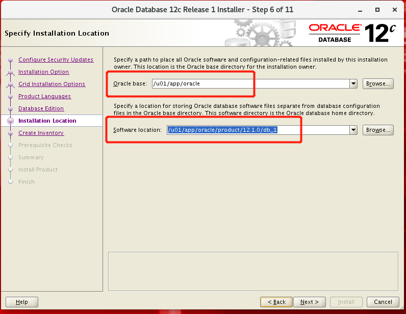
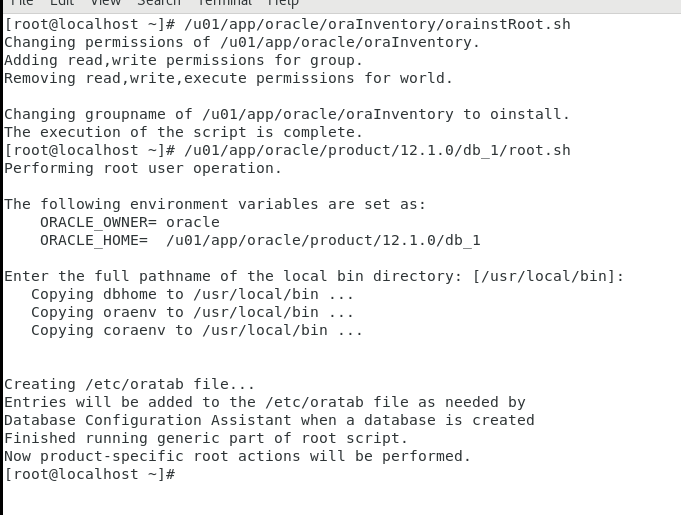

# Oracle安装部署

部署环境：

vmware + Oracle Linux Release 7 Update 8 for x86(64 bit)

安装好OLR之后，执行

```shell
yum install oracle-rdbms-server-12cR1-preinstall* -y
cat /var/log/oracle-rdbms-server-12cR1-preinstall/backup/Sep-18-2022-15-41-05/orakernel.log 
```

配置登录参数

```
/etc/security/limits.conf
```

参数配置


部署时报错

```shell
If you are not able to run xclock successfully, please refer to your PC-X Server or OS vendor for further assistance.
Typical path for xclock: /usr/X11R6/bin/xclock

#解决方法
su - oracle
echo $DISPLAY
export DISPLAY=192.168.12.180:0.0
echo $DISPLAY
#192.168.12.180:0.0
xhost +
#xhost: unable to open display "192.168.12.180:0.0"
```

以上设置之后还是报错


root账户登录执行xhost +，由root切换为oracle错误解决,进入图形界面








安装好之后在oracle用户执行

```shell
[oracle@localhost database]$ sqlplus / as sysdba

SQL*Plus: Release 12.1.0.2.0 Production on Mon Sep 19 23:56:07 2022

Copyright (c) 1982, 2014, Oracle.  All rights reserved.

Connected to an idle instance.

SQL> 
```


## 使用DBCA创建数据库


