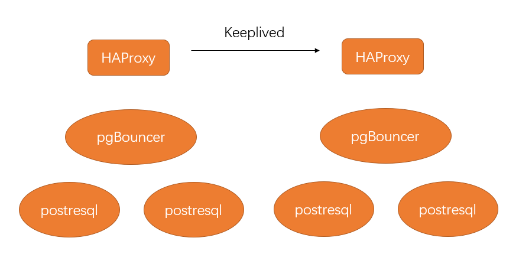

# postgresql高可用实战

## 代理和连接池

集群间基于代理和连接池的高可用架构



### 通过HAProxy实现代理

流行的负载平衡器和代理解决方案。放在应用和数据库之间。

将流量从一个来源分发到一个或者多个目的地

优势：

1、如果有数据库单点故障，可以转移到好的数据节点去。

2、使用副本来提高读取性能

### HAProxy安装

```shell
# 安装编译环境
yum install gcc pcre-devel tar make -y

# 下载并解压haproxy
curl -O  http://www.haproxy.org/download/2.2/src/haproxy-2.2.4.tar.gz
tar xf haproxy-2.2.4.tar.gz
cd haproxy-2.2.4

# 编译并安装haproxy
make TARGET=linux-glibc
make install
mkdir -p /etc/haproxy
mkdir -p /var/lib/haproxy 
touch /var/lib/haproxy/stats
ln -s /usr/local/sbin/haproxy /usr/sbin/haproxy


cp haproxy-2.2.4/examples/haproxy.init /etc/init.d/haproxy
chmod 755 /etc/init.d/haproxy
systemctl daemon-reload
chkconfig haproxy on
useradd -r haproxy
haproxy -v

[root@localhost haproxy-2.2.4]# haproxy -v
HA-Proxy version 2.2.4-de45672 2020/09/30 - https://haproxy.org/
Status: long-term supported branch - will stop receiving fixes around Q2 2025.
Known bugs: http://www.haproxy.org/bugs/bugs-2.2.4.html
Running on: Linux 3.10.0-1160.el7.x86_64 #1 SMP Mon Oct 19 16:18:59 UTC 2020 x86_64

# 配置haproxy.cfg
cat > /usr/local/etc/haproxy/haproxy.cfg <<EOF
#全局配置和默认模块
global
    maxconn 300
defaults
    log global
    mode tcp
    retries 2
    timeout client 30m
    timeout connect 4s
    timeout server 30m
    timeout check 5s
#统计信息配置模块
listen stats
    mode http
    bind *:7000
    stats enable
    stats uri /
#核心配置模块：流复制配置模式。一个master两个slave
Master:pg_master_1(替换为ip地址)
slave:pg_slave_1,pg_slave_2(替换为ip地址)
listen postgres_rw
    bind *:5000
    
    option pgsql-check user optima
    default-server inter 3s fall 3 rise 2 on-marked-down shutdown-sessions
    balance roundrobin
    server pg_master_1 pg_master_1:5432 check port 5432
    server pg_slave_1 pg_slave_1:5432  check port 5432 backup
    server pg_slave_2 pg_slave_2:5432  check port 5432 backup
listen postgres_ro
    bind *:5001
    option pgsql-check user optima
    default-server inter 3s fall 3 rise 2 on-marked-down shutdown-sessions
    balance roundrobin
    server pg_master_1 pg_master_1:5432 check port 5432
    server pg_slave_1 pg_slave_1:5432 check port 5432   weight 100
    server pg_slave_2 pg_slave_2:5432 check port 5432   weight 100
EOF

# 启动
systemctl start haproxy
```

参数解释：

bind：使用端口

option pgsql-check user optima：运行检测状况

balance：平衡算法

​	roundrobin轮询算法，平均分布

​	leastconn最少连接优先，优先分配给少的

​	first:第一台满了之后在发给下一台

​	source:对源IP进行散列，相同客户端IP始终到达一台服务器

### PgBouncer

连接池软件，根据配置创建若干Postgresql连接，以先到先得的方式分配给使用者

### 安装PgBouncer

安装pgbouncer之前需要安装libevent

wget https://pgbouncer.github.io/downloads/files/1.7.2/pgbouncer-1.7.2.tar.gz
wget http://get.enterprisedb.com/postgresql/postgresql-9.5.1-1-linux-x64.run
wget https://github.com/libevent/libevent/releases/download/release-2.0.22-stable/libevent-2.0.22-stable.tar.gz

参考安装连接

http://t.zoukankan.com/fangyuan303687320-p-5633097.html

```
yum install -y c-ares-devel openssl-devel libevent-devel make gcc

```

```
tar zxvf libevent-2.0.22-stable.tar.gz
cd libevent-2.0.22-stable
./configure --prefix=/user/local/libevent


tar zxvf pgbouncer-1.7.2.tar.gz
cd pgbouncer-1.7.2
./configure --prefix=/user/local/pgbouncer/ --with-libevent=/user/local/libevent/
make 
make install
cd ..

```


编译安装pg时候漏掉一部

/usr/local/pgsql/bin/postgres --version


pgbouncer的安装和配置

https://www.cnblogs.com/dbalightyear/p/11234173.html
