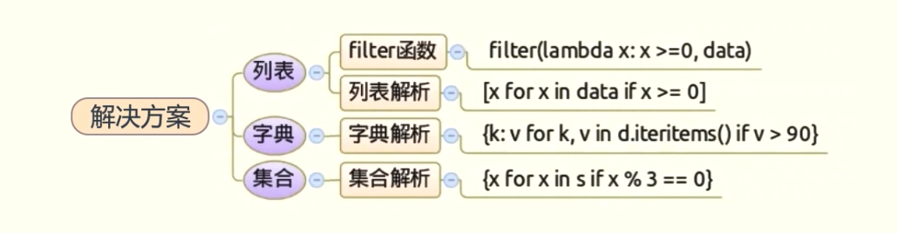
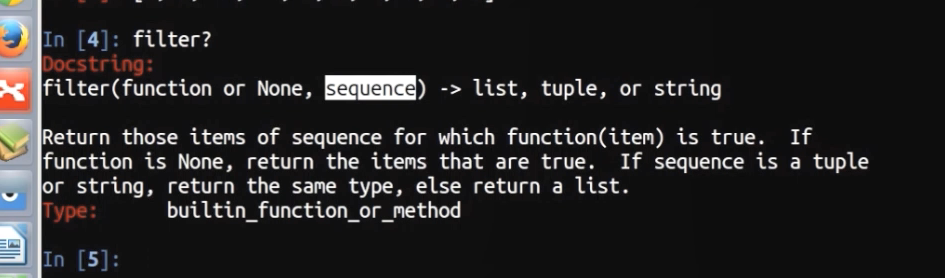
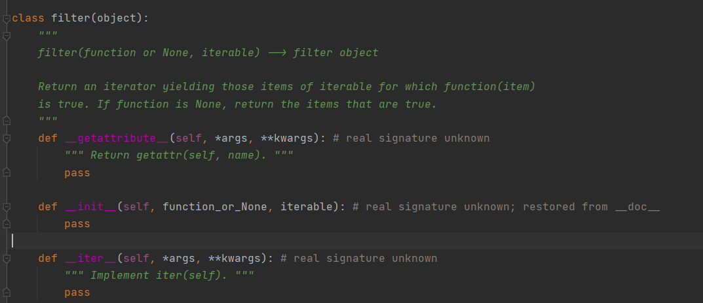

# 如何在列表，字典，集合中根据条件筛选数据




filter函数：两个参数，第一个过滤函数，第二个列表





***Lambda**表达式是一个匿名函数*

## 1、对于列表刷选元素

### 1.1第一种方式：使用filter函数

```python
from random import randint
data = [randint(-10, 10) for _ in range(10)]
print(data)
a= filter(lambda x: x>=0,data)
print(type(a))
print(list(a))
```

结果：

```python
[10, 6, 10, 1, 8, -2, 4, 3, -10, 0]
<class 'filter'>
[10, 6, 10, 1, 8, 4, 3, 0]
```

randint:随机函数生成

x: x>=0 需要一个参数从x传进来，之后返回一个布尔值，返回为真，则返回到filter中去

filter() 函数的返回结果是一个迭代器，我们可以使用 for 循环对其进行遍历，或者使用 list() 函数将其转化为一个列表。

### 1.2第二种方式：使用列表解析

```python
from random import randint
data = [randint(-10, 10) for _ in range(10)]
print(data)
a= [x for x in data if x >=0]
print(a)
```

结果：

```python
[8, -7, -6, 4, 1, 5, 10, 3, 10, 4]
[8, 4, 1, 5, 10, 3, 10, 4]
```

a值的书写顺序：先写for以及后面得，再写前面的x

### 结论

首选列表解析，使用timeit测试的时候，列表解析最快，远快于for迭代的方案


## 2、对于字典筛选某些元素

### 2.1使用字典解析，类似于列表解析

```python
from random import randint
d = {x: randint(60,100) for x in range(11)}
print(d)
c = {k: v for k,v in d.items() if v>90}
print(c)
```

结果：

```python
{0: 100, 1: 91, 2: 82, 3: 99, 4: 81, 5: 68, 6: 68, 7: 99, 8: 94, 9: 89, 10: 70}
{0: 100, 1: 91, 3: 99, 7: 99, 8: 94}
```

## 3、对于集合筛选某些元素

```python
from random import randint
data = [randint(-10,10) for _ in range(10)]
s =set(data)
print(s)
# 找出能被3整除的子集
a={ i for i in s if i%3 ==0 and i!=0}
print(list(a))
```

结果

```python
{1, 2, 3, 4, 6, -10, -6, -5}
[-6, 3, 6]
```

