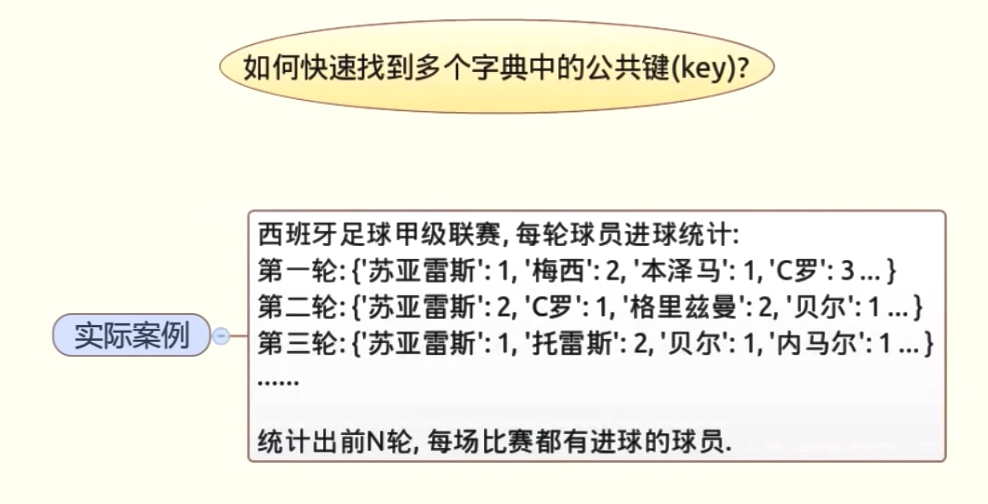

# 如何快速找到多个字典的公共键



## 1、普通循环操作

```python
from random import randint,sample
# 随机取样3个
# a = sample('abcdefg',3)
# a = sample('abcdefg',randint(3,6))
s1 = {x:randint(3,6) for x in sample('abcdfeg',randint(3,6))}
print(s1)
s2 = {x:randint(3,6) for x in sample('abcdfeg',randint(3,6))}
print(s2)
s3 = {x:randint(3,6) for x in sample('abcdfeg',randint(3,6))}
print(s3)
res =[]
for k in s1:
    if k in s2 and k in s3:
        res.append(k)
print(res)
```

结果：

```python
{'e': 3, 'g': 3, 'f': 4}
{'e': 4, 'c': 4, 'a': 6, 'd': 5, 'b': 3, 'g': 4}
{'b': 3, 'e': 5, 'd': 5, 'g': 4}
['e', 'g']
```

## 2、利用集合（set）的交集操作


### 2.1使用字典的keys方法获取键值

```python
from random import randint,sample
# 随机取样3个
# a = sample('abcdefg',3)
# a = sample('abcdefg',randint(3,6))
s1 = {x:randint(3,6) for x in sample('abcdfeg',randint(3,6))}
print(s1)
# 获取键值
print(s1.keys())
s2 = {x:randint(3,6) for x in sample('abcdfeg',randint(3,6))}
print(s2)
s3 = {x:randint(3,6) for x in sample('abcdfeg',randint(3,6))}
print(s3)
a = s1.keys() & s2.keys() & s3.keys()
print(a)
```

结果

```python
{'b': 5, 'g': 6, 'c': 5}
dict_keys(['b', 'g', 'c'])
{'b': 4, 'a': 4, 'c': 3, 'e': 3}
{'g': 3, 'e': 4, 'c': 6, 'f': 4, 'b': 6, 'a': 3}
{'c', 'b'}
```

### 2.2使用reduce函数获得每一轮的集合

```python
from random import randint,sample
from functools import reduce

s1 = {x:randint(3,6) for x in sample('abcdfeg',randint(3,6))}
print(s1)
s2 = {x:randint(3,6) for x in sample('abcdfeg',randint(3,6))}
print(s2)
s3 = {x:randint(3,6) for x in sample('abcdfeg',randint(3,6))}
print(s3)
c = reduce(lambda a,b: a & b , [s1.keys(),s2.keys(),s3.keys()])
print(list(c))
```

结果

```python
{'b': 4, 'd': 4, 'a': 4, 'e': 5}
{'f': 6, 'c': 4, 'g': 3, 'b': 5, 'a': 5, 'e': 4}
{'c': 4, 'a': 5, 'f': 4, 'g': 5, 'b': 5}
['b', 'a']
```

