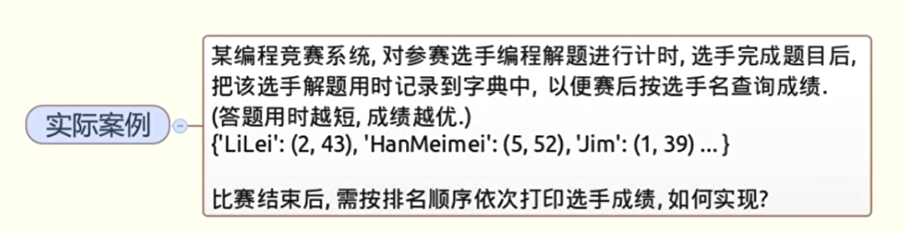
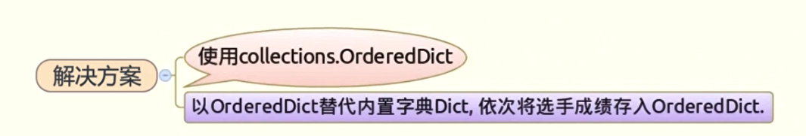

# 如何让字典保持有序





## 1.使用collections.OrderedDict

```python
from collections import OrderedDict
d = OrderedDict()
d['jim'] =(1,35)
d['leo'] = (2,37)
d['cc'] = (3,40)
for k in d:
    print(k)
```

结果

```python
jim
leo
cc
```

## 2.例如

```python
from collections import OrderedDict
from time import time
from random import randint
d =OrderedDict()
players = list('ABCDEFGH')
start = time()
for i in range(8):
    input()
    p = players.pop(randint(0,7-i))
    end =time()
    print(i+1,p,end -start)
    d[p] =(i+1,end - start)
print('*'*20)
for k in d:
    print(k,d[k])
```

结果

```python
1 G 1.921861171722412

2 C 5.1332738399505615

3 B 6.15254807472229

4 E 7.381302833557129

5 D 8.373538732528687

6 F 9.592172145843506

7 A 10.889892578125

8 H 11.81772494316101
********************
G (1, 1.921861171722412)
C (2, 5.1332738399505615)
B (3, 6.15254807472229)
E (4, 7.381302833557129)
D (5, 8.373538732528687)
F (6, 9.592172145843506)
A (7, 10.889892578125)
H (8, 11.81772494316101)
```

