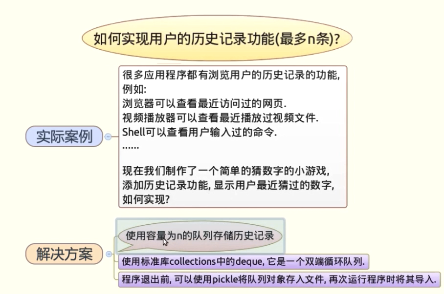

# 如何实现用户历史记录功能



## 1.猜数游戏代码

**注意最开始没有写 return True,导致猜对之后还会走else。**

isdigit() 检测字符串是否只由数字组成

```python
from random import randint
N = randint(1,100)

def guess(k):
    if k==N:
        print('right')
        return True
    if k < N:
        print("%s 小了"%k)
    else:
        print("%s 大了"%k)
    return False
while True:
    line = input("请输入一个数\n")
    if line.isdigit():
        k=int(line)
        if guess(k):
            break
```

结果：

```python
请输入一个数
50
50 大了
请输入一个数
25
25 小了
请输入一个数
30
30 小了
请输入一个数
40
right
```

## 2.使用collections 的deque函数，它是一个双循环队列

```python
from random import randint
from collections import deque
history=deque([],5)
N = randint(0,100)

def guess(k):
    if k==N:
        print('right')
        return True
    if k < N:
        print("%s 小了"%k)
    else:
        print("%s 大了"%k)
    return False
while True:
    line = input("请输入一个数\n")
    if line.isdigit():
        k=int(line)
        history.append(line)
        if guess(k):
            break
    elif line == 'history' or line =='h':
        print(list(history))
```

结果：

```python
请输入一个数
20
20 小了
请输入一个数
40
40 大了
请输入一个数
h
['20', '40']
请输入一个数
```

## 3.程序退出前，可以使用pickle将队列对象存入文件，再次运行程序时将其导入

```python
from random import randint
from collections import deque
import pickle
history=deque([],5)
N = randint(0,100)

def guess(k):
    if k==N:
        print('right')
        return True
    if k < N:
        print("%s 小了"%k)
    else:
        print("%s 大了"%k)
    return False
while True:
    line = input("请输入一个数\n")
    if line.isdigit():
        k=int(line)
        history.append(line)
        f = open('history','wb')
        pickle.dump(list(history),f)
        if guess(k):
            break
    elif line == 'history' or line =='h':
        print(list(history))
    elif line == 'c':
        pass
        f = open('history', 'rb')
        data = pickle.load(f)
        print(data)


```

结果：

```python
请输入一个数
10
10 小了
请输入一个数
20
20 小了
请输入一个数
30
30 小了
请输入一个数
h
['10', '20', '30']
请输入一个数
c
['10', '20', '30']
请输入一个数
```

