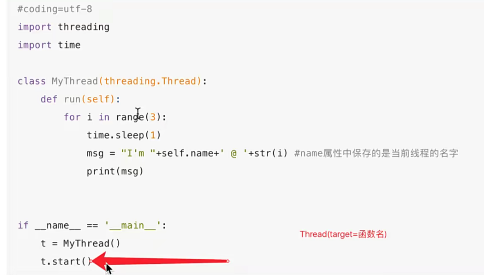
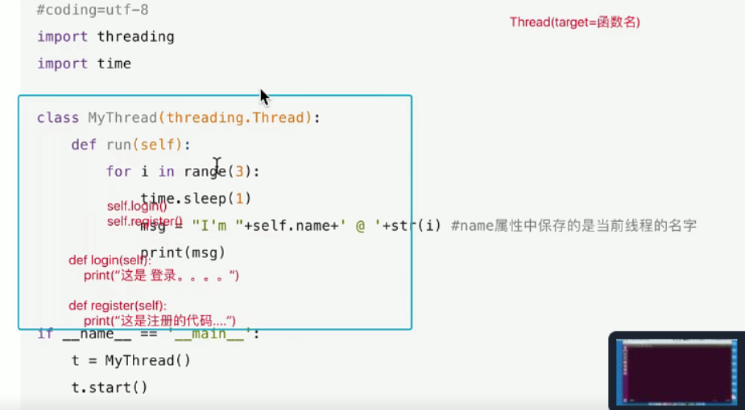
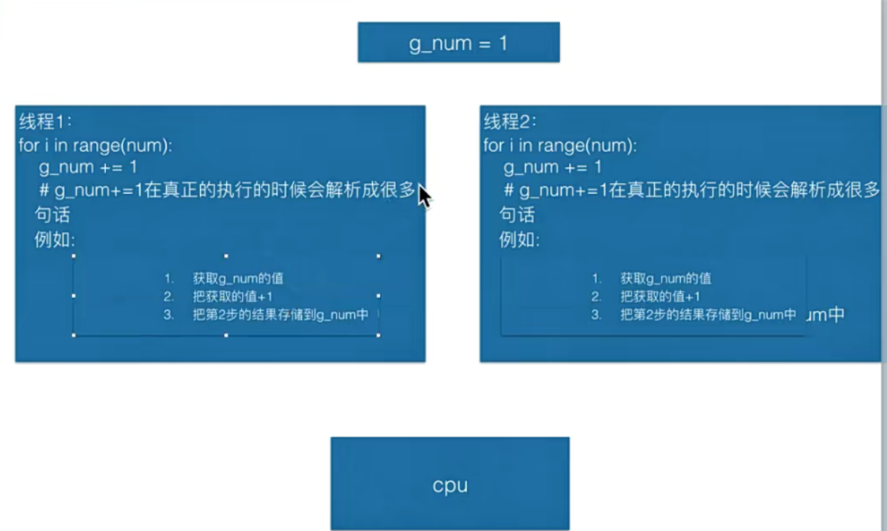
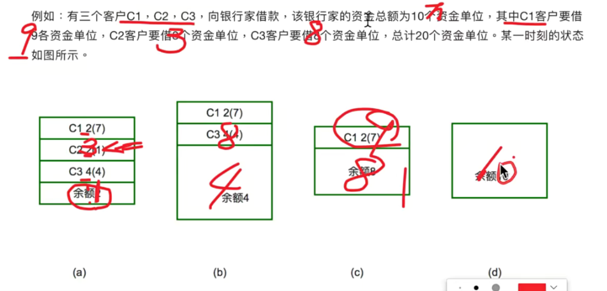

理解时间片轮转，同一时刻只能做一个任务

优先级调度算法

并行：多个任务一起再跑

并发：假的多任务，cpu数量小于任务数量

什么是线程

实现多任务的一个手段

当调用Thread的时候不会创建线程，

当调用Thread创建出来的实例对象的start方法的时候才会创建线程以及让这个线程开始运行

线程结束函数结束，不能确定哪个子线程先执行。

类的三大特性，封装，继承，多态

定义一个类继承Thread,会自动调用run方法，run方法作完，子线程结束。封装成类

多个线程之间共享全局变量

## 什么时候需要加上global

在一个函数中对全局变量进行修改的时候是否要加gloabl进行说明

要看，是否对全局变量的指向进行修改。

如果执向了新的地方，必须使用global，

如果仅仅修改了指向空间的数据，此时不用

## 资源竞争

如果多线程里变共享全局变量，同一时刻都在对全局变量写操作，可能会出问题

同步的概念

协同一起做事情

互斥锁

当多个线程同时修改一个共享数据的时候，需要进行同步控制

某个线程要更改共享数据时，先将其”锁定“状态;其他线程不能更改,直到该线程释放资源，将状态改为非锁定，其他资源才能用

## 如何创建互斥锁

创建锁

mutex = threading.Lock()

锁定

mutex.acquire()

释放

mutex.release()

## 死锁

两个线程分别占有一部分资源变并且同时等待对方的资源。就会造成死锁

## 避免死锁的方法

银行家算法

添加超时时间

银行家算法

## 多任务udp聊天器

