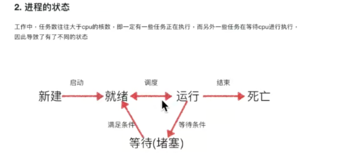

多进程实现多任务

引入multiprocessing模块

调用的时候和threading使用方法一致

p1 = multiprocessing.Process(target(test1))

p1.start()

可以在后台看到有多个进程的多任务

```shell
[root@VM-4-13-centos process]# ps -ef|grep 01
root         6     2  0 Apr11 ?        00:01:00 [ksoftirqd/0]
root      1195     1  0 Apr11 ?        00:01:49 /usr/sbin/crond -n
root      1694     2  0 01:53 ?        00:00:00 [kworker/0:2]
root      1837 27021  0 Aug13 ?        01:46:31 barad_agent
root      2592  2591  0 Aug13 ?        00:01:15 nginx: worker process
root      2637     2  0 01:58 ?        00:00:03 [kworker/0:0]
root      6515  1620  0 10:45 pts/1    00:00:00 python 01.对比多?程和多线程.py
root      6516  6515  0 10:45 pts/1    00:00:00 python 01.对比多?程和多线程.py
root      6517  6515  0 10:45 pts/1    00:00:00 python 01.对比多?程和多线程.py
```

使用threading的时候只有一个任务,且ctrl + C停止不了，只有一个线程

```shell
[root@VM-4-13-centos process]# ps -ef|grep 01
root         6     2  0 Apr11 ?        00:01:00 [ksoftirqd/0]
root      1195     1  0 Apr11 ?        00:01:49 /usr/sbin/crond -n
root      1694     2  0 01:53 ?        00:00:00 [kworker/0:2]
root      1837 27021  0 Aug13 ?        01:46:31 barad_agent
root      2592  2591  0 Aug13 ?        00:01:15 nginx: worker process
root      2637     2  0 01:58 ?        00:00:03 [kworker/0:0]
root      7076  7065  0 Sep13 ?        01:23:30 /usr/local/nodejs/node-v14.15.3-linux-x64/bin/node /root/vuepress-theme-vdoing/node_modules/.bin/vuepress dev docs
root      7344  1620  0 10:49 pts/1    00:00:00 python 01.对比多?程和多线程.py
```

主进程有什么子进程就有什么资源，代码是共享的

代码+资源 = 进程

进程多不一定是越多越好，进程占用资源大，线程占有资源少

## 进程和线程的区分

手机上qq多开理解为多进程。资源和代码的总称

线程是进程起的资源，线程去运行的，例如总线程

进程之间互相独立，线程之间共享全局变量

进程可以理解为流水线，线程就是流水线上的工人

优缺点：

进程资源浪费，线程占用资源少


## 多任务如何实现

一份代码多个箭头（线程）

多个资源，每个资源一个箭头


## 进程间通信

进程间通信实现

1.socket。

2.文件

3.queue队列（先进先出）


### 队列

初始化queue对象

q=Queue(3)

判断队列是否满了

q.full(),没有满返回False,满了返回True

q.empty()判断是否为空


往队列里面放数据

q.put(XXX)，XXX为任意数据类型

q.get()，取数据，数据内容先进先出，没有可取数据时，一直等待数据

q.get_nowait()取数据，没有可取得数据得时候报错，不等待

q.full()判断是否为满

q.empty()判断是否为空


用queue得目的，解耦

耦和性越低越好

比如下载数据和处理数据

使用queue之后可以边下载，边处理。


## 进程池

先创建一个池里面有一些进程。

引入进程池，减少了程序进程创建和销毁的时间。使用以前的进程。避免开销

任务数不确定采用进程池

如何创建进程池

1.导入multiprocessing 的pool类

2.创建一个进程池，最大进程数为3

po =Pool(3)

3.po.apply_async(worker,(XXX)):worker是函数名称，XXX是需要传的参数

4.关闭进程池

po.close()

5.等待进程池中的所有任务执行完了之后在往下执行。

po.join()


## 多任务文件夹copy


