# 资产探测版块介绍

## 1.资产管理的内容

扫描探测服务，主动收集信息

优势

补充：虚拟机里面的虚拟机不在探测

imoocc项目里面

自动化扫描是在main.py里实现的，可以定时任务执行这个文件

## 2.整体探测流程

存活探测

trancroute

局域网内部扫描

 

-PE探测主机的存活状态,展示主机当前的一些服务，**确认服务是否存活**

探测哪些常存在的

## 3.python的nmap使用

安装

在ipython中测试，等待返回结果

展示IP列表

判断是否是linux

在ipython中测试

密钥登录信息确认参数打开

确保权限正确

权限正确以后把rsa.pub拷贝到客户端/tmp/id_rsa

## 4.python的ssh登录模块

pexpect安装

测试

正则匹配

send会加上回车符，sendline不会

相关脚本在script/4_4_9_ssh_login_password

## 5.Paramiko模块

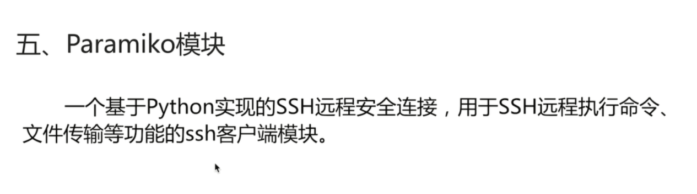

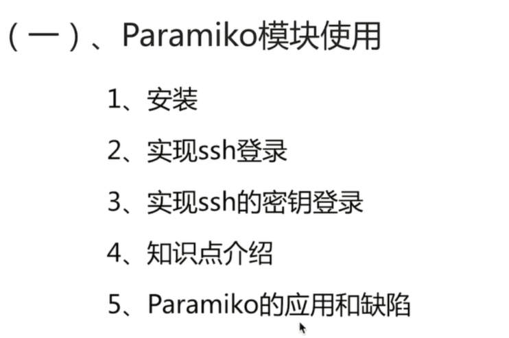

安装模块

pip install paramiko

在ipython中测试

import paramiko

hnow_hosts里面记录的是为了避免劫持

2：实例化对象

3：自动记录到know_hosts

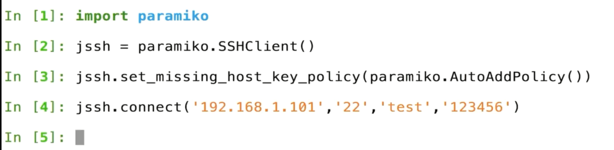

以上建立起了连接

13：加载密钥

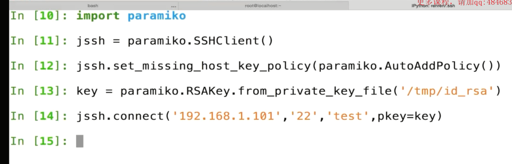

建立好了连接之后，怎么运行命令

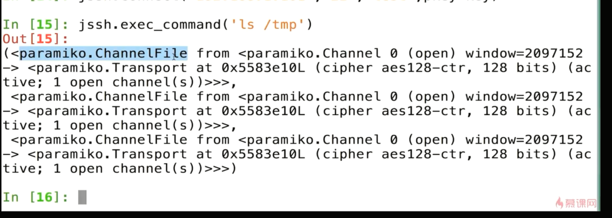

返回结果标准，错误

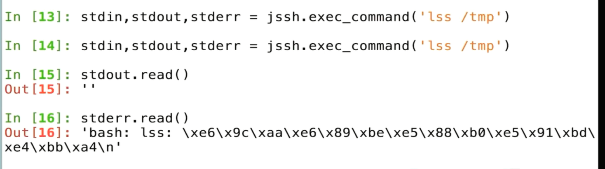

# 登陆探测工程

## 1，机器资产信息获取

获取操作系统信息

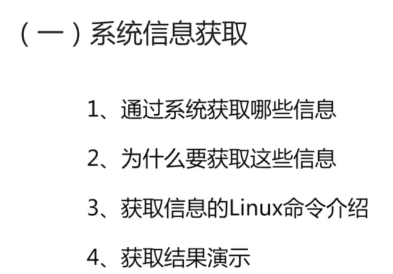

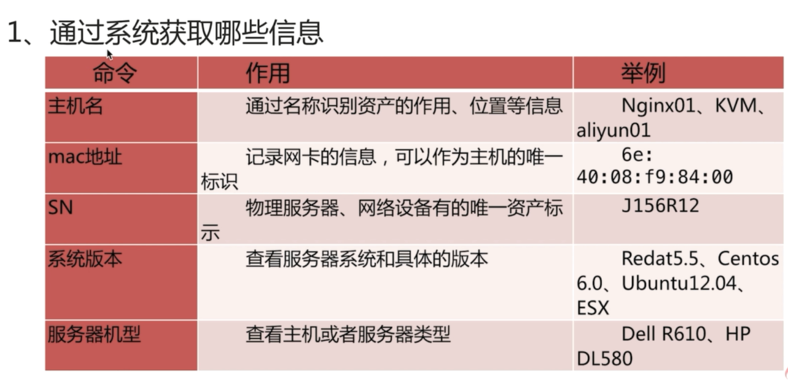

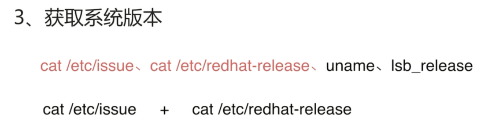

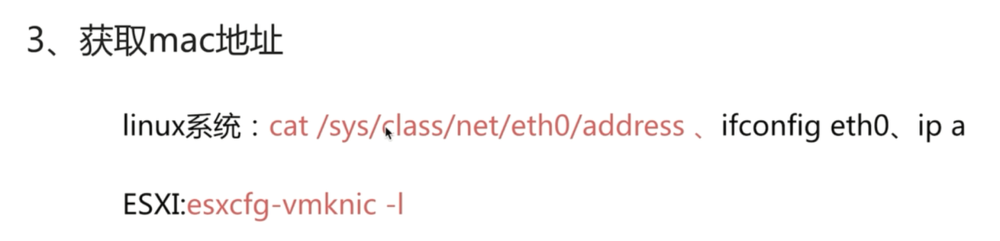

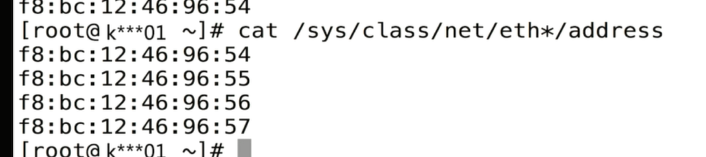

不是以为这些开头的，获取网卡地址

esxi信息

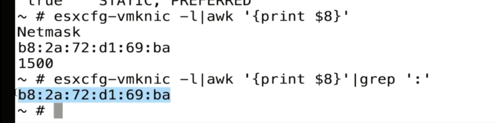

同时获取，第一个执行失败执行第二个

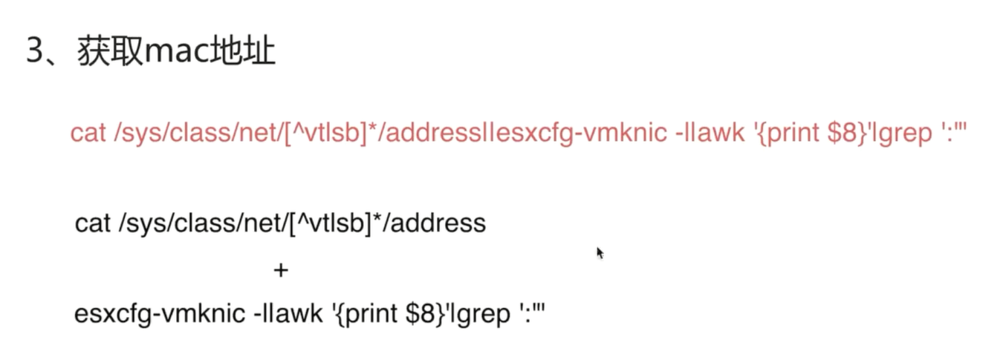

## 2.工程讲解

安装PyYAML

pip install PyYAML

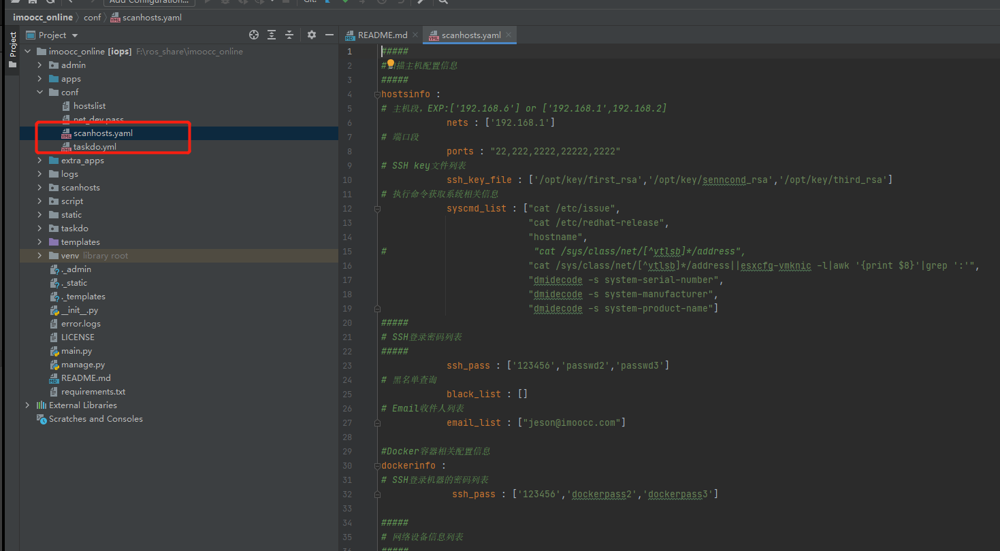

读取方式测试

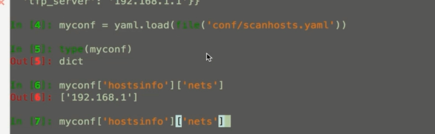

查看main文件进行扫描的，需要仔细分析这个文件

在4-19讲解的

对数据加密解密测试

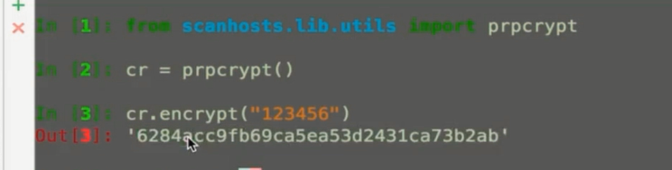

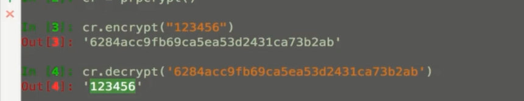

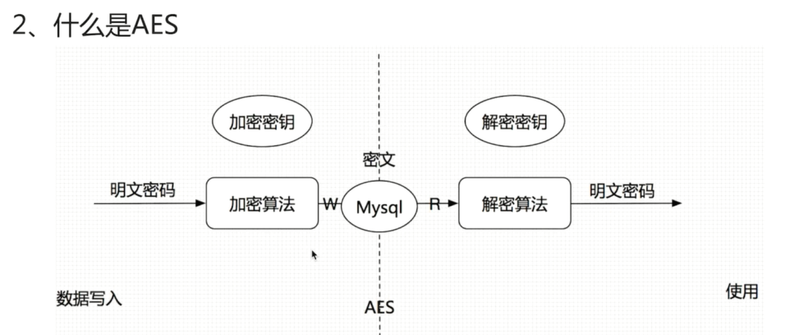

main.py文件调试

和前面网段配置调整

开始扫描

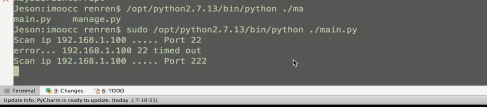

扫描的相关信息

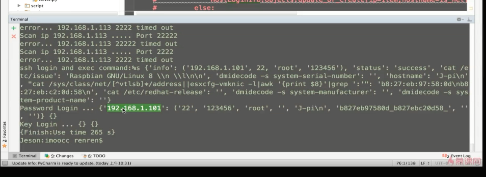

看数据库里面的信息

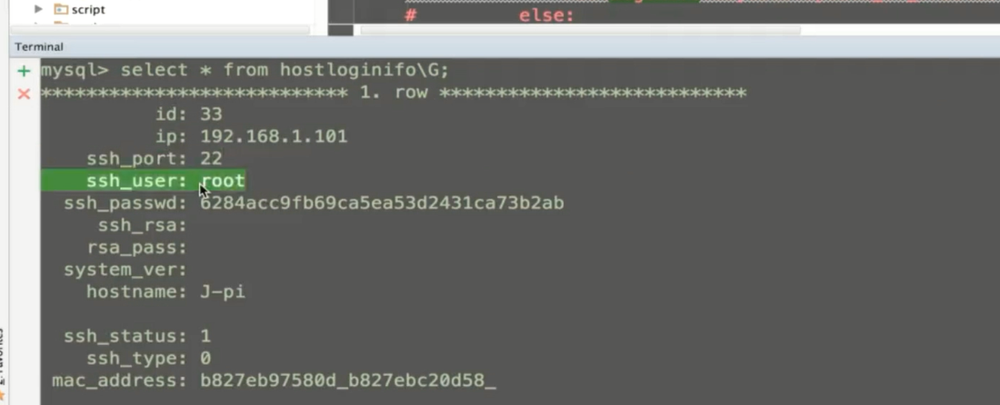

邮件的信息

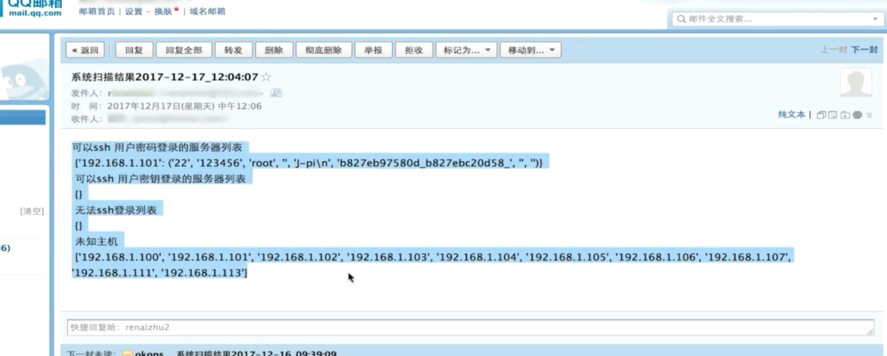

整体逻辑

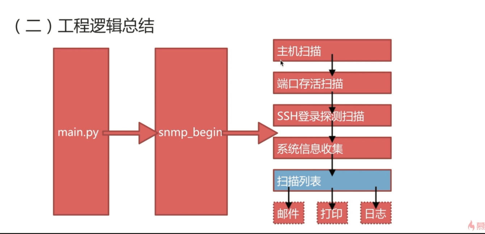

