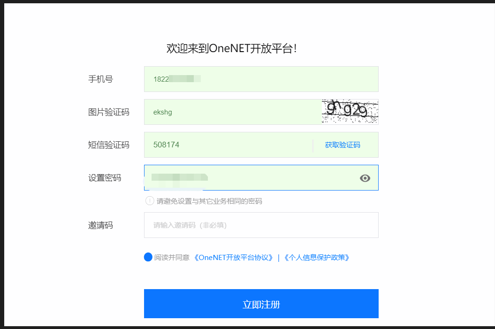

查看温度

vcgencmd measure_temp

查看引脚

```
pi@raspberrypi:~ $ pinout
,--------------------------------.
| oooooooooooooooooooo J8     +====
| 1ooooooooooooooooooo      P | USB
|  Wi                     ooo +====
|  Fi  Pi Model 3B+ V1.3  ooE    |
|        ,----.               +====
| |D|    |SoC |               | USB
| |S|    |    |               +====
| |I|    `----'                  |
|                   |C|     +======
|                   |S|     |   Net
| pwr        |HDMI| |I||A|  +======
`-| |--------|    |----|V|-------'

Revision           : a020d3
SoC                : BCM2837
RAM                : 1024Mb
Storage            : MicroSD
USB ports          : 4 (excluding power)
Ethernet ports     : 1
Wi-fi              : True
Bluetooth          : True
Camera ports (CSI) : 1
Display ports (DSI): 1

J8:
   3V3  (1) (2)  5V    
 GPIO2  (3) (4)  5V    
 GPIO3  (5) (6)  GND   
 GPIO4  (7) (8)  GPIO14
   GND  (9) (10) GPIO15
GPIO17 (11) (12) GPIO18
GPIO27 (13) (14) GND   
GPIO22 (15) (16) GPIO23
   3V3 (17) (18) GPIO24
GPIO10 (19) (20) GND   
 GPIO9 (21) (22) GPIO25
GPIO11 (23) (24) GPIO8 
   GND (25) (26) GPIO7 
 GPIO0 (27) (28) GPIO1 
 GPIO5 (29) (30) GND   
 GPIO6 (31) (32) GPIO12
GPIO13 (33) (34) GND   
GPIO19 (35) (36) GPIO16
GPIO26 (37) (38) GPIO20
   GND (39) (40) GPIO21

For further information, please refer to https://pinout.xyz/
```

## 树莓派开启VNC

https://blog.csdn.net/henkun/article/details/104343630

## 获取温度传感器

https://blog.csdn.net/qq_57398262/article/details/124823408

## ONE注册

查看温度

vcgencmd measure_temp

查看引脚

```
pi@raspberrypi:~ $ pinout
,--------------------------------.
| oooooooooooooooooooo J8     +====
| 1ooooooooooooooooooo      P | USB
|  Wi                     ooo +====
|  Fi  Pi Model 3B+ V1.3  ooE    |
|        ,----.               +====
| |D|    |SoC |               | USB
| |S|    |    |               +====
| |I|    `----'                  |
|                   |C|     +======
|                   |S|     |   Net
| pwr        |HDMI| |I||A|  +======
`-| |--------|    |----|V|-------'

Revision           : a020d3
SoC                : BCM2837
RAM                : 1024Mb
Storage            : MicroSD
USB ports          : 4 (excluding power)
Ethernet ports     : 1
Wi-fi              : True
Bluetooth          : True
Camera ports (CSI) : 1
Display ports (DSI): 1

J8:
   3V3  (1) (2)  5V    
 GPIO2  (3) (4)  5V    
 GPIO3  (5) (6)  GND   
 GPIO4  (7) (8)  GPIO14
   GND  (9) (10) GPIO15
GPIO17 (11) (12) GPIO18
GPIO27 (13) (14) GND   
GPIO22 (15) (16) GPIO23
   3V3 (17) (18) GPIO24
GPIO10 (19) (20) GND   
 GPIO9 (21) (22) GPIO25
GPIO11 (23) (24) GPIO8 
   GND (25) (26) GPIO7 
 GPIO0 (27) (28) GPIO1 
 GPIO5 (29) (30) GND   
 GPIO6 (31) (32) GPIO12
GPIO13 (33) (34) GND   
GPIO19 (35) (36) GPIO16
GPIO26 (37) (38) GPIO20
   GND (39) (40) GPIO21

For further information, please refer to https://pinout.xyz/
```

## 树莓派开启VNC

https://blog.csdn.net/henkun/article/details/104343630

## 获取温度传感器

https://blog.csdn.net/qq_57398262/article/details/124823408

## ONE注册




